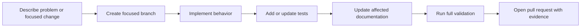

# Contributing to Uplink Ledger

Uplink Ledger exists to collect defensible Internet-path evidence without
claiming more than ICMP observations can prove. Contributions should preserve
that restraint, the small operational footprint, and upgrade compatibility.

## Useful references

- [Development and releases](docs/development.md)
- [Architecture](docs/architecture.md)
- [Evidence model](docs/evidence-model.md)
- [Configuration](docs/configuration.md)

Use [Troubleshooting](docs/troubleshooting.md) before treating an installation
or environment problem as an application defect.

## Contribution flow



## Development setup

The production runtime uses only Python's standard library. Unit tests do not
require a running PostgreSQL server because database subprocess calls are
isolated.

```sh
git clone https://github.com/jodytripp/uplink-ledger.git
cd uplink-ledger

python3 -m py_compile uplink_ledger.py import_csv_to_postgres.py scripts/check_docs.py
python3 scripts/check_docs.py
sh -n install.sh
python3 -m unittest discover -s tests -v
```

Two tests create temporary loopback HTTP servers, so the local environment
must allow binding ephemeral localhost ports.

## Design expectations

- Keep the installed runtime free of third-party Python packages unless an
  architectural need outweighs the deployment and maintenance cost.
- Preserve AlmaLinux 10 and native `systemd` operation.
- Keep PostgreSQL mandatory and authoritative.
- Preserve exact wall-clock intervals and parallel target correlation.
- Discard incomplete intervals rather than manufacturing complete-looking
  aggregates.
- Prefer conservative diagnosis language when rate limiting, asymmetry, or
  Router behavior prevents a narrow attribution.
- Preserve existing service, role, database, configuration, and data paths
  unless an explicit migration is included.
- Keep the dashboard independent of a JavaScript build toolchain and external
  runtime resources.
- Add focused regression coverage for behavioral changes.
- Update the guide that owns the affected behavior; the mapping is in
  [Development and releases](docs/development.md#keeping-documentation-current).

## Pull requests

Keep each pull request focused. Include:

- the operator or monitoring problem;
- behavior before and after;
- evidence supporting a changed diagnosis or threshold;
- validation performed;
- installation, persistence, security, and upgrade impact;
- documentation updated; and
- redacted screenshots for material dashboard changes.

Do not commit production certificates, private keys, public IP addresses,
private network diagrams, database dumps, discovery caches, monitoring CSVs,
or unredacted screenshots.

## Compatibility review

Before changing a stored or operational contract, identify the migration for:

- PostgreSQL tables, keys, or data types;
- CSV header/schema version;
- `UPLINK_LEDGER_ARGS` and command-line options;
- discovery cache schema;
- static API response fields;
- `/opt`, `/etc`, and `/var/lib` paths;
- `uplinkledger` identity and `uplink-ledger.service`; and
- chart history or diagnosis semantics.

An existing operator should be able to upgrade without losing history,
configuration, certificates, or discovery identity.

## Bug reports and feature proposals

Use the repository templates. Include the Uplink Ledger version, AlmaLinux and
PostgreSQL versions, relevant redacted journal lines, steps to reproduce, and
which guide was followed.

Security issues follow [SECURITY.md](SECURITY.md), not the public issue tracker.
