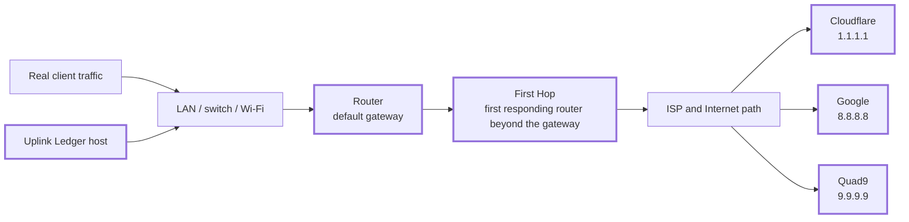
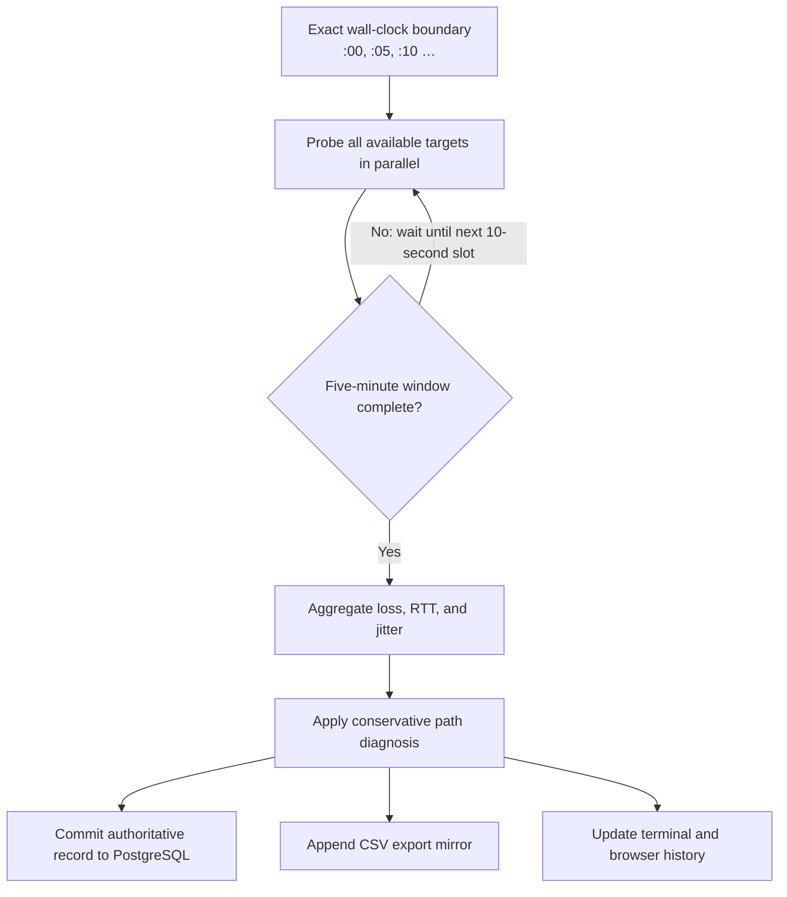

# Uplink Ledger

[](https://github.com/jodytripp/uplink-ledger/actions/workflows/test.yml)
[](LICENSE)

Uplink Ledger is a self-contained Internet-path quality monitor for an
AlmaLinux 10 server or VM on the network being measured. It continuously
records packet loss, latency, and jitter from the same side of the router as
real clients, then presents the record in PostgreSQL, CSV, a terminal, and a
live TLS dashboard.

Its purpose is narrower—and more useful—than simply answering whether the
Internet is “up”:

> When a client has trouble, where does the first measurable problem appear?

## The path Uplink Ledger measures



The Router measurement establishes whether the monitoring client can reliably
reach its own default gateway. The First Hop and three unrelated public
destinations show whether loss continues beyond that point. Correlated results
are much stronger evidence than a ping to any single address.

## How one five-minute record is made



With the defaults, each target receives five pings every ten seconds. A full
interval therefore contains up to 30 synchronized bursts and 150 observations
per destination. An interrupted interval is discarded instead of being
presented as a complete measurement.

## What the evidence means

| Pattern | Most defensible conclusion |
| --- | --- |
| Router clean; First Hop and multiple public targets lose packets | The measured client-to-Router path is clean. Loss begins at or beyond the Router's forwarding/WAN path. |
| Router clean; multiple public targets lose packets; First Hop unavailable | Downstream loss is present, but traceroute filtering prevents locating the first responding ISP router. |
| Router and multiple public targets lose packets | Investigate the monitoring host, LAN, Router interface, or Router load before attributing the problem to the ISP. |
| First Hop loses packets; public targets are clean | The intermediate router is probably limiting ICMP replies while forwarding traffic normally. |
| Only one public target loses packets | The evidence points to target-specific routing or ICMP behavior, not a general access-link failure. |

A clean Router measurement does **not** prove that the Router's NAT,
forwarding, or WAN interface is healthy. It proves that the monitored path from
the host to the Router responds cleanly. See [Understanding the
evidence](docs/01-evidence-model.md) for the complete reasoning model and its
limitations.

## Why this design

Uplink Ledger deliberately favors boring, durable infrastructure:

| Choice | Why it fits this application |
| --- | --- |
| Python standard library | One readable service with no package ecosystem or framework upgrade treadmill. |
| Operating-system `ping`, `traceroute`, `curl`, and `psql` | Uses mature tools already understood by Linux operators and keeps packet and database behavior observable from the shell. |
| PostgreSQL | Durable, typed, queryable history that survives restarts and can grow for long-running installations. |
| Static HTML, CSS, and JavaScript | No build pipeline, Node.js runtime, frontend framework, or CDN dependency. |
| Built-in HTTPS on 443 | A direct, conventional URL with no reverse proxy required; port 80 performs redirects only. |
| `systemd` | Native startup, logging, restart policy, capabilities, and service hardening on AlmaLinux. |
| ICMP from a client-side host | Measures the same local path real users depend on without installing monitoring software on the Router. |

The result is intentionally deployable without Docker, a Python virtual
environment, Node.js, Redis, a message broker, or a separate web server. The
full tradeoff analysis is in [Architecture and technology
choices](docs/06-architecture.md).

## Capabilities

- Simultaneous Router, First Hop, Cloudflare, Google, and Quad9 probes.
- Exact five-minute intervals aligned to wall-clock `:00`, `:05`, `:10`, and
  so on.
- Packet loss, minimum/average/maximum RTT, jitter, sent, and received counts.
- Persistent First-Hop cache tied to the Router and public IPv4 identity.
- Conservative fault classification intended to avoid overstating ISP
  responsibility.
- PostgreSQL as the authoritative, restart-safe history store.
- CSV mirror, browser download, and standalone historical CSV importer.
- Rolling averages, high/low summaries, and restart-safe continuous runtime.
- Independent packet-loss and latency chart ranges with hover, drag, scroll,
  and Latest controls.
- Built-in TLS on TCP 443 and permanent HTTP-to-HTTPS redirects on TCP 80.
- Terminal-friendly live status and journal-friendly completed-interval lines.
- An unprivileged, capability-limited, hardened `systemd` service.

## Requirements

- AlmaLinux 10 with `systemd`.
- A wired connection is strongly recommended for the monitoring host.
- Root access for installation and service management.
- Local PostgreSQL using Unix-socket peer authentication.
- A certificate/full-chain PEM file and unencrypted PEM private key.
- TCP 80 and 443 available on the host.
- Outbound ICMP, HTTPS, and traceroute traffic.

PostgreSQL and TLS are mandatory for the installed service. Plain HTTP is
available only through the explicit `--insecure-http` development option.

## Installation overview

The complete procedure—including PostgreSQL peer authentication, certificate
permissions, firewall rules, validation, upgrades, and removal—is in the
[Installation guide](docs/02-installation.md).

```sh
git clone https://github.com/jodytripp/uplink-ledger.git
cd uplink-ledger

sudo dnf install -y \
  python3 iputils traceroute curl openssl postgresql postgresql-server

sudo postgresql-setup --initdb
sudo systemctl enable --now postgresql

sudo ./install.sh

sudo -u postgres createuser \
  --no-superuser --no-createdb --no-createrole ispmon
sudo -u postgres createdb --owner=ispmon isp_loss_monitor
```

After configuring peer authentication and installing the TLS certificate:

```sh
sudo systemctl enable --now isp-loss-monitor
sudo systemctl status isp-loss-monitor
```

Open `https://YOUR_MONITOR_HOST/`. The service waits for the next exact
five-minute boundary before starting its first complete interval.

## Documentation: read it in this order

The documentation is organized around the application lifecycle rather than
an alphabetical file list.

1. [Understand the evidence model](docs/01-evidence-model.md)—what each target
   proves, what it cannot prove, and how classification works.
2. [Install Uplink Ledger](docs/02-installation.md)—prepare AlmaLinux,
   PostgreSQL, TLS, the firewall, and `systemd`.
3. [Configure measurements and services](docs/03-configuration.md)—sampling,
   discovery, database, TLS, terminal, and history settings.
4. [Operate it continuously](docs/04-operations.md)—startup, intervals,
   upgrades, backup, recovery, runtime continuity, and service commands.
5. [Read the dashboard and build an ISP case](docs/05-reading-results.md)—UI,
   charts, diagnosis thresholds, false positives, and evidence collection.
6. [Understand the architecture and technology choices](docs/06-architecture.md)—
   components, threads, failure isolation, dependencies, and design tradeoffs.
7. [Use the data model, API, CSV, and SQL](docs/07-data-and-api.md)—schema,
   durability, endpoints, exports, imports, and useful queries.
8. [Secure the deployment](docs/08-security.md)—trust boundaries,
   capabilities, TLS, headers, firewalling, and certificate renewal.
9. [Troubleshoot symptoms methodically](docs/09-troubleshooting.md)—a
   symptom-first diagnostic path.
10. [Develop and release changes](docs/10-development.md)—source layout,
    local testing, test strategy, compatibility, and release workflow.

Start at the [documentation map](docs/README.md) if you are returning with a
specific task in mind.

## Operational compatibility

The public product and repository are named **Uplink Ledger**. Existing
operational identifiers retain the earlier name so upgrades do not fork state
or strand deployed data:

| Purpose | Stable identifier |
| --- | --- |
| Service | `isp-loss-monitor.service` |
| Application directory | `/opt/isp-loss-monitor` |
| Configuration | `/etc/sysconfig/isp-loss-monitor` |
| TLS files | `/etc/isp-loss-monitor` |
| Runtime state and CSV | `/var/lib/isp-loss-monitor` |
| PostgreSQL database | `isp_loss_monitor` |
| PostgreSQL and OS role | `ispmon` |

## Development

The runtime has no third-party Python dependencies. The release checks are:

```sh
python3 -m py_compile isp_loss_monitor.py import_csv_to_postgres.py scripts/check_docs.py
python3 scripts/check_docs.py
sh -n install.sh
python3 -m unittest discover -s tests -v
```

See [CONTRIBUTING.md](CONTRIBUTING.md) and the [development
guide](docs/10-development.md) before submitting a change.

## Security and license

The dashboard exposes network addresses and connection-quality history. It
provides TLS but no application login, so restrict it to trusted networks. See
[SECURITY.md](SECURITY.md) and the [deployment security guide](docs/08-security.md).

Uplink Ledger is released under the [MIT License](LICENSE).
