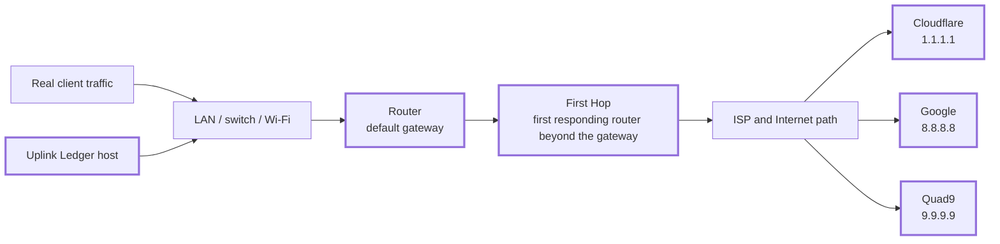
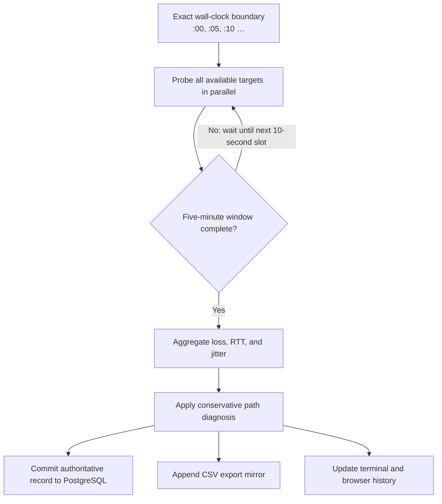

# Uplink Ledger

[](https://github.com/jodytripp/uplink-ledger/actions/workflows/test.yml)
[](LICENSE)

Uplink Ledger is a self-contained Internet-path quality monitor for an
AlmaLinux 10 server or VM on the network being measured. It continuously
records packet loss, latency, and jitter from the same side of the router as
real clients, then presents the record in PostgreSQL, CSV, a terminal, and a
live TLS dashboard.

Its purpose is narrower—and more useful—than simply answering whether the
Internet is “up”:

> When a client has trouble, where does the first measurable problem appear?

## The path Uplink Ledger measures



The Router measurement establishes whether the monitoring client can reliably
reach its own default gateway. The First Hop and three unrelated public
destinations show whether loss continues beyond that point. Correlated results
are much stronger evidence than a ping to any single address.

## How one five-minute record is made



With the defaults, each target receives five pings every ten seconds. A full
interval therefore contains up to 30 synchronized bursts and 150 observations
per destination. An interrupted interval is discarded instead of being
presented as a complete measurement.

## What the evidence means

| Pattern | Most defensible conclusion |
| --- | --- |
| Router clean; First Hop and multiple public targets lose packets | The measured client-to-Router path is clean. Loss begins at or beyond the Router's forwarding/WAN path. |
| Router clean; multiple public targets lose packets; First Hop unavailable | Downstream loss is present, but traceroute filtering prevents locating the first responding ISP router. |
| Router and multiple public targets lose packets | Investigate the monitoring host, LAN, Router interface, or Router load before attributing the problem to the ISP. |
| First Hop loses packets; public targets are clean | The intermediate router is probably limiting ICMP replies while forwarding traffic normally. |
| Only one public target loses packets | The evidence points to target-specific routing or ICMP behavior, not a general access-link failure. |

A clean Router measurement does **not** prove that the Router's NAT,
forwarding, or WAN interface is healthy. It proves that the monitored path from
the host to the Router responds cleanly. See [Understanding the
evidence](docs/evidence-model.md) for the complete reasoning model and its
limitations.

## Capabilities

- Simultaneous Router, First Hop, Cloudflare, Google, and Quad9 probes.
- Exact five-minute intervals aligned to wall-clock `:00`, `:05`, `:10`, and
  so on.
- Packet loss, minimum/average/maximum RTT, jitter, sent, and received counts.
- Persistent First-Hop cache tied to the Router and public IPv4 identity.
- Conservative fault classification intended to avoid overstating ISP
  responsibility.
- PostgreSQL as the authoritative, restart-safe history store.
- CSV mirror, browser download, and standalone historical CSV importer.
- Rolling averages, high/low summaries, and restart-safe continuous runtime.
- Independent packet-loss and latency chart ranges with hover, drag, scroll,
  and Latest controls.
- Built-in TLS on TCP 443 and permanent HTTP-to-HTTPS redirects on TCP 80.
- Terminal-friendly live status and journal-friendly completed-interval lines.
- An unprivileged, capability-limited, hardened `systemd` service.

## Requirements

- AlmaLinux 10 with `systemd`.
- A wired connection is strongly recommended for the monitoring host.
- Root access for installation and service management.
- Local PostgreSQL using Unix-socket peer authentication.
- A certificate/full-chain PEM file and unencrypted PEM private key.
- TCP 80 and 443 available on the host.
- Outbound ICMP, HTTPS, and traceroute traffic.

PostgreSQL and TLS are mandatory for the installed service. Plain HTTP is
available only through the explicit `--insecure-http` development option.

## Installation overview

The complete procedure—including PostgreSQL peer authentication, certificate
permissions, firewall rules, and validation—is in the
[Installation guide](docs/installation.md).

```sh
git clone https://github.com/jodytripp/uplink-ledger.git
cd uplink-ledger

sudo dnf install -y \
  python3 iputils traceroute curl openssl postgresql postgresql-server

sudo postgresql-setup --initdb
sudo systemctl enable --now postgresql

sudo ./install.sh

sudo -u postgres createuser \
  --no-superuser --no-createdb --no-createrole uplinkledger
sudo -u postgres createdb --owner=uplinkledger uplink_ledger
```

After configuring peer authentication and installing the TLS certificate:

```sh
sudo systemctl enable --now uplink-ledger
sudo systemctl status uplink-ledger
```

Open `https://YOUR_MONITOR_HOST/`. The service waits for the next exact
five-minute boundary before starting its first complete interval.

## Documentation

### Set up and run

- [Installation](docs/installation.md)
- [Configuration](docs/configuration.md)
- [Operations](docs/operations.md)

### Understand the results

- [Evidence model](docs/evidence-model.md)
- [Interpreting dashboard results](docs/interpreting-results.md)

### Reference and maintenance

- [Architecture](docs/architecture.md)
- [Data model, API, CSV, and SQL](docs/data-and-api.md)
- [Security](docs/security.md)
- [Troubleshooting](docs/troubleshooting.md)
- [Development and releases](docs/development.md)

The [documentation map](docs/README.md) also links common tasks directly to the
relevant guide.

## Installed identifiers

| Purpose | Stable identifier |
| --- | --- |
| Service | `uplink-ledger.service` |
| Application directory | `/opt/uplink-ledger` |
| Configuration | `/etc/sysconfig/uplink-ledger` |
| TLS files | `/etc/uplink-ledger` |
| Runtime state and CSV | `/var/lib/uplink-ledger` |
| PostgreSQL database | `uplink_ledger` |
| PostgreSQL and OS role | `uplinkledger` |

Running `install.sh` over a pre-1.4 installation migrates the earlier service
identity, paths, database, tables, certificates, cache, and CSV history. Review
the [upgrade procedure](docs/operations.md#upgrade-procedure) before applying
the rename to an existing server.

## Development

The runtime has no third-party Python dependencies. The release checks are:

```sh
python3 -m py_compile uplink_ledger.py import_csv_to_postgres.py scripts/check_docs.py
python3 scripts/check_docs.py
sh -n install.sh
python3 -m unittest discover -s tests -v
```

See [CONTRIBUTING.md](CONTRIBUTING.md) and the [development
guide](docs/development.md) before submitting a change.

## Security and license

The dashboard exposes network addresses and connection-quality history. It
provides TLS but no application login, so restrict it to trusted networks. See
[SECURITY.md](SECURITY.md) and the [deployment security guide](docs/security.md).

Uplink Ledger is released under the [MIT License](LICENSE).
