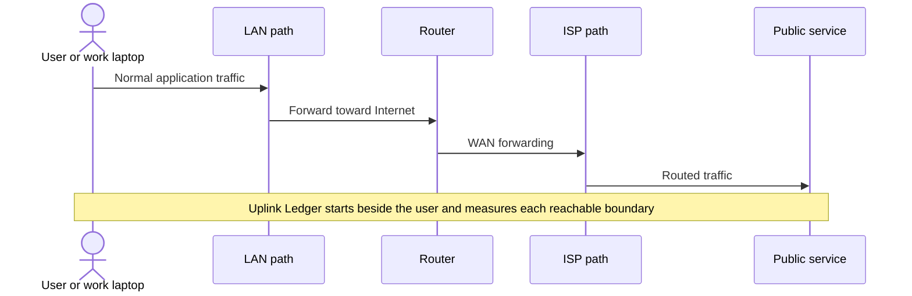
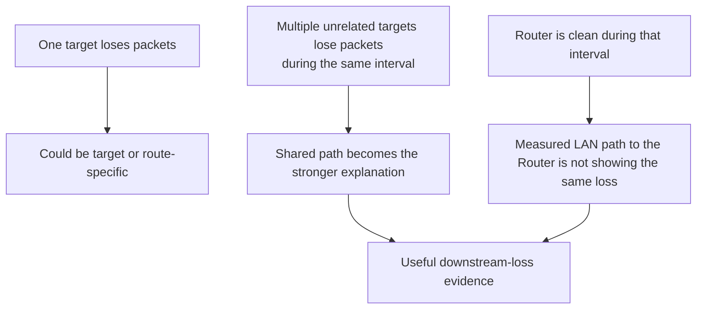
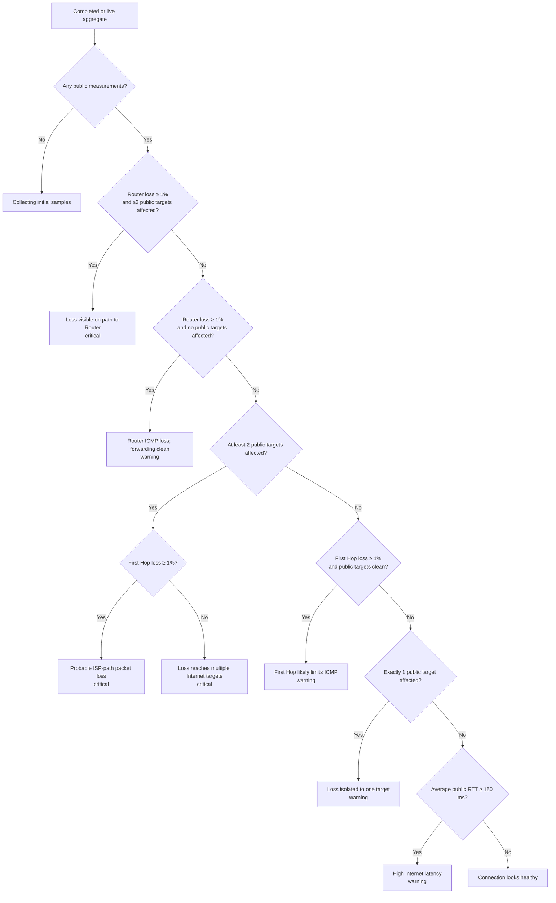
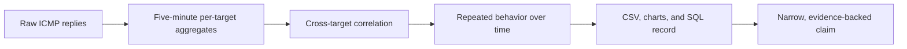

# 1 · Evidence model

Uplink Ledger is designed to locate the first **observable** change in path
quality. It does not claim that every router answers ICMP equally, that an
Internet path is symmetric, or that a ping alone identifies a failed piece of
hardware.

That restraint is important. Evidence becomes more credible when the monitor
states exactly what it measured and stops short of conclusions the data cannot
support.

## Why measure from a client-side host?

Running on a LAN host includes the same local switching, VLAN, cabling, and
Router-reachability path used by real clients. Running on the Router would
exclude some of that path and could make a client-visible problem disappear
from the test.

A wired host is best because it removes changing radio conditions from the
evidence. A Wi-Fi deployment is valid, but Router loss could then represent
the wireless link rather than the wired LAN or ISP.

## What each target contributes

| Target | What a clean result supports | What loss might mean |
| --- | --- | --- |
| Router | The monitoring host can reach its default gateway reliably over the measured LAN path. | Host load, NIC, cable, Wi-Fi, switch/VLAN, Router LAN interface, Router ICMP limiting, or Router load. |
| First Hop | The first responding device beyond the Router is answering consistently. | ISP access path trouble **or** ICMP rate limiting on that router. |
| Cloudflare | One independent public route forwards ICMP consistently. | That route, endpoint ICMP policy, or a shared upstream problem. |
| Google | A second independent public route forwards ICMP consistently. | That route, endpoint ICMP policy, or a shared upstream problem. |
| Quad9 | A third independent public route forwards ICMP consistently. | That route, endpoint ICMP policy, or a shared upstream problem. |

The public endpoints are not used as DNS resolvers by Uplink Ledger. Their
numeric addresses are probe destinations, avoiding DNS resolution as another
failure variable.

## Why several destinations matter

The monitor does not compare unrelated samples taken twenty minutes apart.
Every available target is probed in parallel during the same five-minute
window, making correlation meaningful.

## Metrics and calculations

For each target and completed interval:

- **Sent / received** are the ICMP echo requests issued and echo replies parsed.
- **Packet loss** is `(sent - received) / sent × 100`.
- **Minimum RTT** is the quickest valid reply.
- **Average RTT** is the arithmetic mean of valid replies.
- **Maximum RTT** is the slowest valid reply.
- **Jitter** is the mean absolute difference between consecutive valid RTT
  observations.
- **Errors** counts bursts that timed out, could not start, or lacked a normal
  ping summary.

Invalid, negative, or non-finite RTT values are ignored. If a killed or timed-
out ping process produced reply lines but no summary, those replies are kept
while the configured ping count remains the conservative sent count.

## Exact classification flow

A destination is considered affected when its completed-interval loss is at
least `1.0%`. “Multiple public targets” means at least two of Cloudflare,
Google, and Quad9.

This is a status classifier, not a root-cause oracle. The raw per-target values
remain the evidence; the message is a compact interpretation of them.

## What the monitor can support

Strong statements stay close to the observation:

- “The Router showed 0% loss while three public destinations showed correlated
  loss during these intervals.”
- “The first responding hop and all three public targets degraded at the same
  times.”
- “The problem was visible from a wired LAN client for 47 completed
  five-minute intervals.”

Those are more defensible than naming a cable, node, CMTS, peering link, or
individual router that the monitor cannot directly inspect.

## What it cannot prove by itself

Uplink Ledger is not:

- a bandwidth or throughput test;
- a TCP, QUIC, DNS, or application-availability monitor;
- a modem signal-level reader;
- a Router CPU, NAT-table, or WAN-interface monitor;
- proof that the forward and return path are identical;
- proof that a non-responding intermediate router dropped forwarded packets;
- a substitute for ISP-side telemetry.

An overloaded Router can answer LAN pings cleanly while its forwarding path
struggles. An intermediate router can drop pings addressed to itself while
forwarding later hops perfectly. That is why Uplink Ledger emphasizes patterns
across the full path.

## Evidence chain at a glance

Next: [Install Uplink Ledger](02-installation.md).
