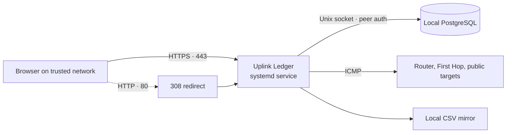
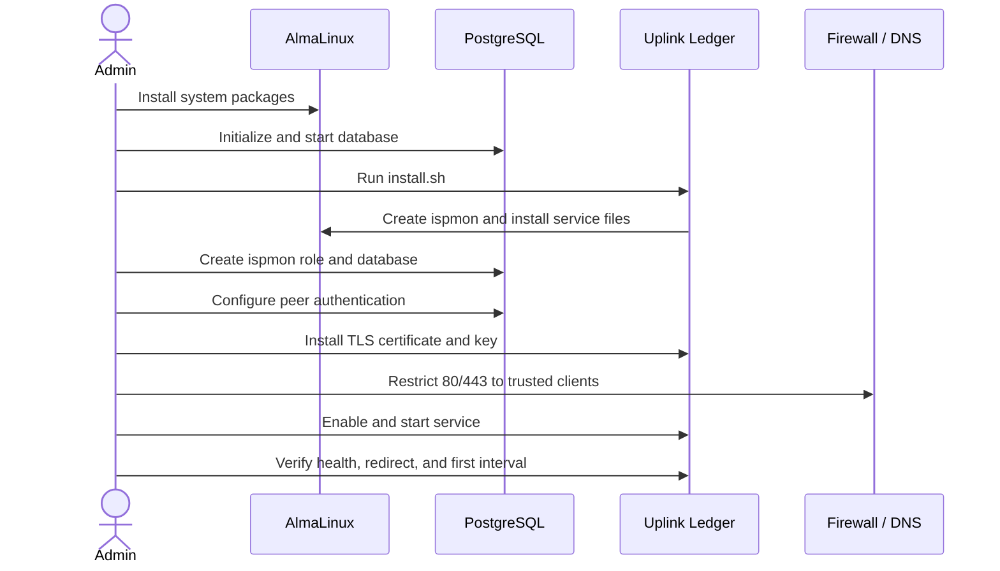

# 2 · Installation

This guide installs Uplink Ledger on an AlmaLinux 10 server or VM connected to
the LAN being measured. PostgreSQL is local and mandatory. The web dashboard
uses TLS on port 443, and port 80 redirects to HTTPS.

## Deployment shape



## Before installation

Prepare:

- a stable AlmaLinux 10 host or VM;
- a wired LAN connection where practical;
- a DNS name for the dashboard;
- a certificate/full-chain PEM matching that DNS name;
- an unencrypted PEM private key;
- a trusted management subnet allowed to reach TCP 80 and 443; and
- root or `sudo` access.

Confirm that no other service owns ports 80 or 443:

```sh
sudo ss -ltnp '( sport = :80 or sport = :443 )'
```

## Installation flow



## 1. Clone the repository

```sh
git clone https://github.com/jodytripp/uplink-ledger.git
cd uplink-ledger
```

For a production deployment, select the desired version from the repository's
[published tags](https://github.com/jodytripp/uplink-ledger/tags) instead of
assuming `main` will remain unchanged.

## 2. Install operating-system packages

```sh
sudo dnf install -y \
  python3 iputils traceroute curl openssl postgresql postgresql-server
```

These packages provide the Python runtime, certificate inspection, and the
external tools intentionally used by the service: `ping`, `traceroute`,
`curl`, and `psql`.

## 3. Initialize PostgreSQL

Skip database initialization if PostgreSQL is already configured on this host.

```sh
sudo postgresql-setup --initdb
sudo systemctl enable --now postgresql
sudo systemctl status postgresql
```

## 4. Install the application

```sh
sudo ./install.sh
```

The installer:

- creates the unprivileged `ispmon` operating-system account if needed;
- creates application, configuration, and data directories;
- installs the Python service, dashboard, documentation, importer, and unit;
- installs a default sysconfig file only when one does not already exist; and
- reloads the `systemd` unit inventory without starting the monitor.

It intentionally preserves existing configuration, certificates, PostgreSQL
data, discovery cache, and CSV history.

## 5. Create the database identity

The operating-system user created by the installer must map to a PostgreSQL
role with the same name:

```sh
sudo -u postgres createuser \
  --no-superuser --no-createdb --no-createrole ispmon
sudo -u postgres createdb --owner=ispmon isp_loss_monitor
```

If either already exists, do not recreate it.

Add this rule to `/var/lib/pgsql/data/pg_hba.conf` **before broader local
rules**:

```text
local   isp_loss_monitor   ispmon   peer
```

PostgreSQL uses the first matching authentication rule. Reload it and verify
the socket connection:

```sh
sudo systemctl reload postgresql
sudo -u ispmon psql -d isp_loss_monitor -c 'SELECT current_user;'
```

The result should be `ispmon` without a password prompt. Uplink Ledger does not
need a stored database password in this deployment.

## 6. Install TLS material

```sh
sudo install -o root -g ispmon -m 0640 fullchain.pem \
  /etc/isp-loss-monitor/server.crt
sudo install -o root -g ispmon -m 0640 private-key.pem \
  /etc/isp-loss-monitor/server.key
```

The private key must be unencrypted because an unattended `systemd` service
cannot answer a passphrase prompt. Ownership and mode allow the service group
to read the files without making them world-readable.

Validate the certificate before starting:

```sh
openssl x509 \
  -in /etc/isp-loss-monitor/server.crt \
  -noout -subject -issuer -dates -ext subjectAltName
```

## 7. Review configuration

```sh
sudo vi /etc/sysconfig/isp-loss-monitor
```

The supplied `ISPMON_ARGS` value listens on every IPv4 interface, serves HTTPS
on 443, redirects 80 to HTTPS, uses local PostgreSQL peer authentication, and
stores state under `/var/lib/isp-loss-monitor`.

If automatic Router discovery is wrong, append an explicit address inside the
quoted value:

```text
--gateway-address 192.168.1.1
```

See [Configuration](03-configuration.md) before changing measurement timing.

## 8. Restrict network access

Uplink Ledger intentionally has no application login. Do not expose it
directly to the public Internet.

Example `firewalld` rules for `192.168.1.0/24`:

```sh
sudo firewall-cmd --permanent \
  --add-rich-rule='rule family="ipv4" source address="192.168.1.0/24" port port="80" protocol="tcp" accept'
sudo firewall-cmd --permanent \
  --add-rich-rule='rule family="ipv4" source address="192.168.1.0/24" port port="443" protocol="tcp" accept'
sudo firewall-cmd --reload
```

Adapt the source subnet and zone policy to the actual network. The installer
does not open firewall ports automatically. Verify the active zone does not
already allow the `http` or `https` service from every source; a broad existing
allow rule takes precedence over the intended restricted-access design.

## 9. Start the service

```sh
sudo systemctl enable --now isp-loss-monitor
sudo systemctl status isp-loss-monitor --no-pager -l
```

The first startup performs schema creation, history recovery, discovery, and
web-server startup, then waits for the next exact five-minute boundary.

## 10. Verify the complete path

Check TLS and health:

```sh
curl --fail https://monitor.example.com/api/health
```

For a private CA, supply its CA file rather than disabling verification:

```sh
curl --fail --cacert internal-ca.pem \
  https://monitor.example.com/api/health
```

Check the port-80 redirect:

```sh
curl --head http://monitor.example.com/
```

The response should be `308 Permanent Redirect` with an HTTPS `Location`.

Check discovery and live state:

```sh
curl --fail 'https://monitor.example.com/api/status?limit=1'
sudo journalctl -u isp-loss-monitor -n 50 --no-pager
```

After the next complete five-minute interval, verify database rows:

```sh
sudo -u ispmon psql -d isp_loss_monitor -c \
  'SELECT count(*), min(interval_start), max(interval_end) FROM isp_loss_intervals;'
```

## Installed locations

| Purpose | Location |
| --- | --- |
| Application and installed README | `/opt/isp-loss-monitor` |
| Full installed guides | `/opt/isp-loss-monitor/docs` |
| Service arguments | `/etc/sysconfig/isp-loss-monitor` |
| TLS certificate and key | `/etc/isp-loss-monitor` |
| CSV mirror and discovery cache | `/var/lib/isp-loss-monitor` |
| PostgreSQL database | `isp_loss_monitor` |
| PostgreSQL and OS role | `ispmon` |
| `systemd` unit | `isp-loss-monitor.service` |

The operational name remains `isp-loss-monitor` for upgrade compatibility;
the product name is Uplink Ledger.

## Installation checklist

- [ ] Host is wired or its connection type is documented.
- [ ] DNS resolves the dashboard hostname to the monitoring host.
- [ ] PostgreSQL starts automatically.
- [ ] Peer authentication works as `ispmon` without a password.
- [ ] Certificate SAN matches the dashboard hostname.
- [ ] Private key is unencrypted and mode `0640`, owned by `root:ispmon`.
- [ ] Firewall limits TCP 80 and 443 to trusted networks.
- [ ] `/api/health` succeeds with certificate verification enabled.
- [ ] HTTP redirects to HTTPS.
- [ ] A complete interval appears in PostgreSQL and the dashboard.

Next: [Configure Uplink Ledger](03-configuration.md).
