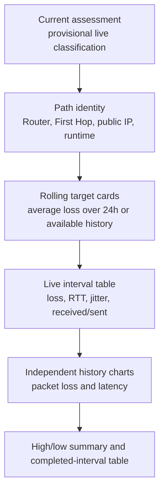
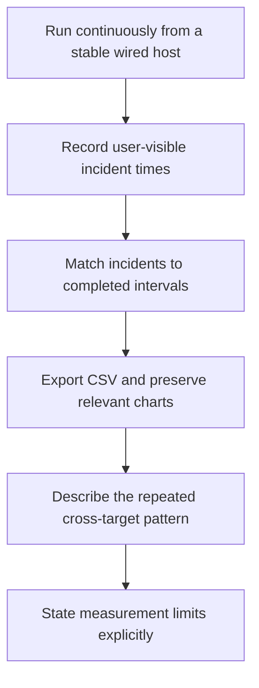

# 5 · Reading results

The dashboard answers three different questions:

1. **What is happening in the interval right now?**
2. **How does the current behavior compare with recent history?**
3. **Where does loss first become visible across the measured path?**

## Dashboard reading order

Read from the top for an immediate incident. Read charts and completed
intervals before making a longer-term claim.

## Current assessment

The banner is calculated from the live interval while it is in progress. Early
in a window it may change as more bursts arrive. The progress bar and completed
burst count show how much evidence currently supports it.

Use the latest **completed** interval or repeated chart pattern for a durable
statement. Live status is operational awareness, not a finalized record.

## Path identity cards

- **Router** shows the default gateway and interface used by the host.
- **First Hop** shows the first responding address beyond the Router plus
  whether it came from traceroute, cache, or stale cache.
- **Public loss summary** shows each Internet target's rolling high and low.
- **Monitor runtime** shows the reconstructed continuous measurement period and
  completed intervals loaded into the browser.

If the public IPv4 or Router identity changes, Uplink Ledger retraces rather
than assuming the old First Hop is still valid.

## Rolling average cards

Each target has one packet-loss average card. The window is the last 24 hours
or all currently available history when less than 24 hours exists. The text on
the card states the actual rolling duration and interval count.

These averages answer “how much loss has this destination seen recently?” They
can hide short, severe outages, so use them together with the high/low summary
and chart.

## Live interval table

| Column | Reading |
| --- | --- |
| Packet loss | Missing echo replies as a percentage of sent requests. |
| Average RTT | Typical round-trip delay among valid replies so far. |
| Maximum RTT | Worst valid reply in the current interval. |
| Jitter | Mean absolute change between consecutive reply times. |
| Received / sent | Sample size behind the percentages. |

A value is `N/A` when the destination was unavailable for measurement, not
automatically `100%` loss.

## History charts

Packet loss and average latency use separate chart state:

- each has its own 24h, 12h, 6h, 4h, or 1h range;
- panning one chart does not move the other;
- wheel/trackpad scrolling and dragging browse older data;
- **Latest** returns that chart to its rolling current window; and
- double-clicking a chart also returns it to Latest.

Hover a line to see the destination, interval time, and exact packet-loss or
latency value. The visible lines represent completed intervals; the live table
represents the current interval.

## Diagnosis codes and thresholds

The status message is derived in a fixed order. Loss is considered present at
`1.0%` or more in a completed or live aggregate.

| Code | Severity | Condition |
| --- | --- | --- |
| `collecting` | neutral | No public-target measurements exist yet. |
| `gateway_loss` | critical | Router loss and at least two affected public targets. |
| `gateway_icmp_limited` | warning | Router loss while all public targets are clean. |
| `isp_path_loss` | critical | At least two public targets and the First Hop show loss. |
| `internet_loss` | critical | At least two public targets show loss without matching First-Hop loss. |
| `hop_icmp_limited` | warning | First Hop loses packets while all public targets are clean. |
| `single_target_loss` | warning | Exactly one public target shows loss. |
| `high_latency` | warning | No preceding loss rule matched and mean public average RTT is at least 150 ms. |
| `healthy` | healthy | None of the above conditions matched. |

See the exact decision diagram in [Evidence model](01-evidence-model.md).

## Common patterns

### Router 0%; First Hop and all public targets degrade together

This is the application's strongest ISP-path pattern. The measured LAN path to
the Router remains responsive while downstream points share the problem.

The careful claim is: “correlated loss begins beyond the measured client-to-
Router path.” Do not name a specific ISP component without ISP telemetry.

### Router 0%; public targets degrade; First Hop is clean or unavailable

The shared downstream path is still suspect. The First Hop may filter probes,
answer differently from forwarded traffic, or not be the constraining point.

### Router and public targets degrade together

The test does not isolate the problem beyond the LAN. Check the monitoring
host's connection, switch/VLAN, Router LAN interface, and Router load.

### First Hop is bad; public targets are clean

Treat this as ICMP de-prioritization unless forwarded destinations also show a
problem. Routers frequently protect their control plane more aggressively than
transit traffic.

### One public endpoint is bad

One route or endpoint is insufficient to establish a general access-link
problem. Watch for correlation with other targets before escalating.

### Loss is clean but users still report slowness

Packet loss is only one quality dimension. Examine latency and jitter, but
remember that Uplink Ledger does not measure throughput, DNS lookup time, TCP
retransmissions, Wi-Fi airtime, or application server performance.

## Building a useful ISP evidence package

Include:

- the monitoring host's connection type and location;
- the date, time zone, and user-visible incident times;
- Router, First-Hop, and public-target values for the same intervals;
- the CSV export covering the period;
- how long the monitor ran and whether material gaps exist;
- recurring latency/jitter behavior where relevant; and
- the narrow conclusion supported by the path correlation.

Avoid publishing unredacted exports or screenshots if public and private
addresses are sensitive.

Next: [Architecture and technology choices](06-architecture.md).
