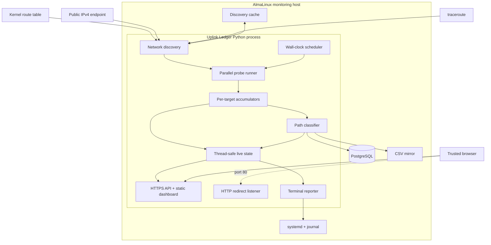
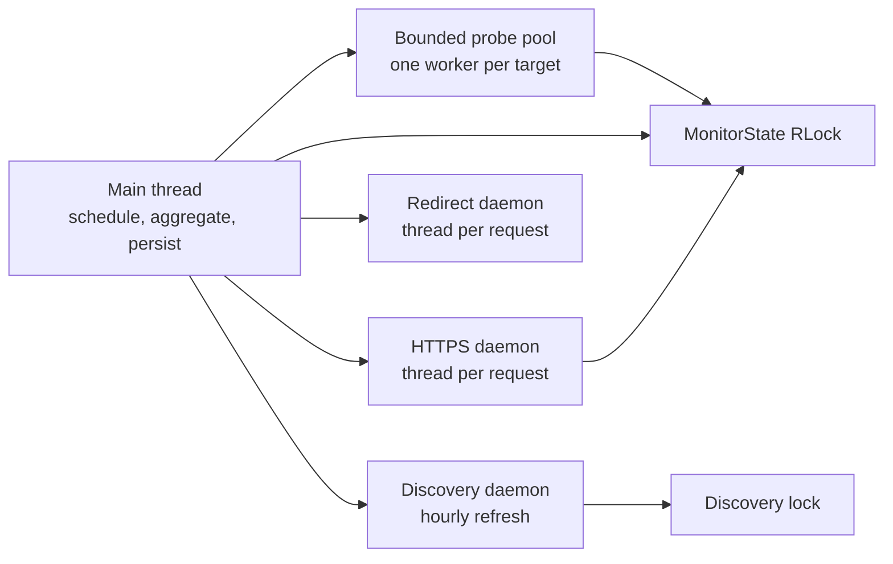
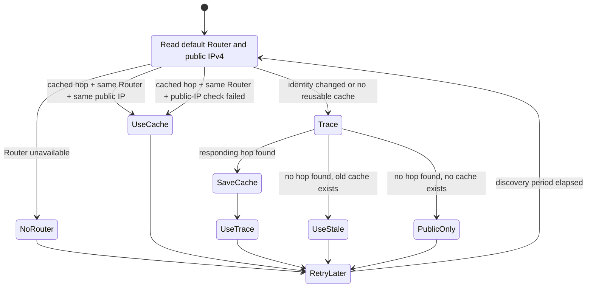
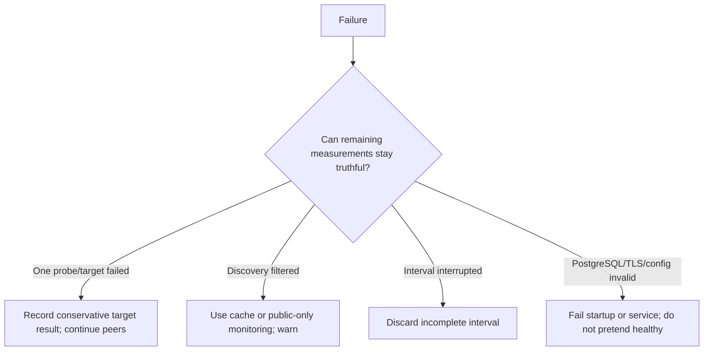

# 6 · Architecture and technology choices

Uplink Ledger is one long-running Python process backed by local PostgreSQL.
It discovers the path, schedules synchronized probes, aggregates results,
persists completed intervals, serves a TLS dashboard, and reports to the
terminal.

The architecture is intentionally small enough for one operator to understand
from end to end.

## Design goals

1. Measure from the same side of the Router as real clients.
2. Compare several path points during the same time window.
3. Preserve complete, queryable history across process and host restarts.
4. Avoid silently recording incomplete intervals as normal data.
5. Run naturally on AlmaLinux with the fewest moving parts practical.
6. Make the service observable with ordinary operating-system tools.
7. Keep classification conservative and the raw measurements accessible.

Non-goals include high-frequency packet capture, distributed telemetry,
multi-tenant access control, synthetic browser tests, and bandwidth testing.

## Complete component view

## Technology stack

### Python standard library

Python provides scheduling, subprocess control, parsing, aggregation,
threading, TLS, HTTP, CSV, JSON, and signal handling without a third-party
runtime package.

Why it fits:

- the workload is I/O-heavy rather than CPU-heavy;
- the code is readable to Linux administrators;
- AlmaLinux provides a maintained system Python;
- upgrades do not depend on PyPI availability; and
- one source file keeps deployment and incident inspection straightforward.

Tradeoff: the built-in HTTP server is not a general-purpose Internet-facing
application server. Uplink Ledger compensates by serving a small trusted-LAN
dashboard, restricting methods and paths, enabling TLS and security headers,
and relying on firewall boundaries rather than claiming multi-user web-app
security.

### Operating-system network tools

`ping`, `traceroute`, `ip`, and `curl` remain separate executables.

Why:

- their behavior is familiar and independently testable from the shell;
- they already handle platform-specific socket details;
- ICMP does not require a custom raw-packet implementation; and
- command output provides a useful diagnostic surface.

Tradeoff: each burst creates processes and parsers must handle platform output.
The ten-second cadence makes that cost modest, and tests cover Linux and
FreeBSD-style ping output.

### PostgreSQL through `psql`

PostgreSQL supplies typed timestamps, `inet` addresses, relational integrity,
transactions, indexes, window functions, JSON construction, and mature backup
tools.

Using `psql` instead of a Python database driver preserves the zero-third-party-
package runtime. Writes happen once per completed interval, so connection and
process overhead is not on a high-frequency request path.

Tradeoff: PostgreSQL is a real service that must be operated. That is accepted
because durable multi-month history, ad hoc analysis, safe upserts, and restart
reconstruction are core requirements—not optional extras.

### Static browser UI

The dashboard is plain HTML, CSS, and JavaScript served from the application.
Charts use Canvas code in the repository rather than an external library.

Why:

- no Node.js or build step;
- no CDN or Internet dependency for the UI;
- source can be inspected directly on the installed host;
- browser polling is enough for five-minute aggregates; and
- deployments contain exactly the reviewed assets.

Tradeoff: interactive chart behavior is maintained in project code rather than
delegated to a framework. Unit tests cover the server contract; UI changes
also require browser verification.

### `systemd`

`systemd` provides service identity, boot startup, restart policy, journaling,
Linux capabilities, dependency ordering, and sandboxing in one native unit.

The service needs only two elevated capabilities:

- `CAP_NET_RAW` for ICMP behavior where required; and
- `CAP_NET_BIND_SERVICE` for ports 80 and 443.

It otherwise runs as the unprivileged `ispmon` account.

### Why no Docker?

Containerization would not remove the need for host networking, raw-ICMP
permission, low-port binding, durable PostgreSQL, TLS files, and host service
management. It would add image builds, registry distribution, volume mapping,
container networking questions, and another failure layer between the client
and the path being measured.

For this single-host network probe, a hardened native service measures the
host's real route more directly and is easier to inspect during an outage.

### Why no reverse proxy?

The required web surface is small: four static assets/API routes, CSV download,
TLS, and an HTTP redirect. Python's TLS server can provide that directly on
443. Removing a reverse proxy means one fewer configuration and certificate
handoff.

A reverse proxy may still be appropriate in a larger managed environment, but
it is not required by Uplink Ledger and should not make the dashboard publicly
reachable.

## Technology alternatives and tradeoffs

| Alternative | Benefit | Why it is not the default |
| --- | --- | --- |
| SQLite | Single file, no database service | Weaker fit for continuous operational querying, concurrent tooling, typed network data, mature remote backup, and long-term expansion. |
| Prometheus + Grafana | Powerful metrics ecosystem | Several additional services and configuration layers for a focused single-host tool; raw evidence ownership becomes distributed. |
| Node.js frontend toolchain | Large UI ecosystem | Build artifacts, dependency updates, and runtime/toolchain complexity are unnecessary for this dashboard. |
| Flask/FastAPI/Django | Productive web frameworks | The API surface is small and does not justify framework and server dependencies. |
| Router-resident monitoring | Direct WAN visibility | Excludes part of the client path and ties deployment to Router firmware/platform constraints. |
| Sequential pings | Simple control flow | Measurements would describe different time windows and weaken correlation. |
| High-frequency raw socket engine | Fine-grained telemetry | More privilege, code, storage, and traffic than the five-minute evidence goal requires. |

## Process and thread model

The main thread owns interval boundaries and durable writes. The discovery
thread updates an immutable discovery snapshot under a lock. `MonitorState`
uses a re-entrant lock so browser requests can obtain consistent snapshots
while probe results update live data.

Probe exceptions are converted into conservative failed results for that
target. One destination cannot terminate the remaining target probes.

## Discovery state machine

The cache is written through a temporary file, flushed, synchronized, and
atomically replaced. Failed public-IP checks or traceroutes do not erase a
previously useful hop.

At startup, recent PostgreSQL/CSV history can seed a missing discovery cache,
which preserves First-Hop continuity across upgrades from older releases.

## Scheduling and concurrency

The next interval is always the next wall-clock multiple of the configured
duration. Inside the interval, monotonic time controls burst spacing so small
wall-clock adjustments do not distort waits.

Each burst submits every available target to a bounded thread pool. The main
thread waits for those results, updates accumulators, then advances to the next
slot. If processing runs late, the scheduler skips past missed slots rather
than compressing several bursts together.

## Persistence order

At interval completion the current implementation:

1. constructs one immutable record;
2. appends and `fsync`s the CSV row;
3. writes the interval and measurements in one PostgreSQL transaction;
4. publishes the completed record to in-memory history; and
5. reports completion to the terminal.

If PostgreSQL fails after the CSV append, service failure makes the problem
visible. At the next startup, recent CSV history is upserted into PostgreSQL,
repairing that narrow interruption window.

## Failure philosophy

The design favors visible gaps over fabricated completeness and visible
service failure over silent loss of authoritative data.

Next: [Data model, API, and exports](07-data-and-api.md).
