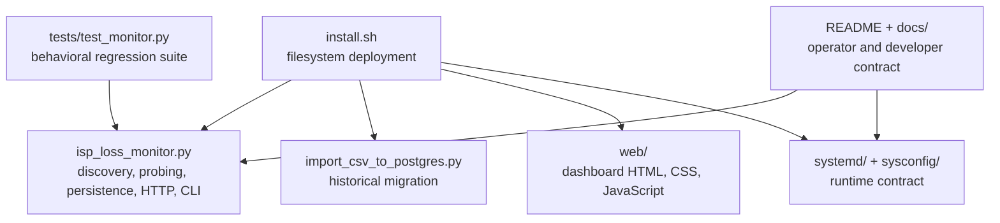
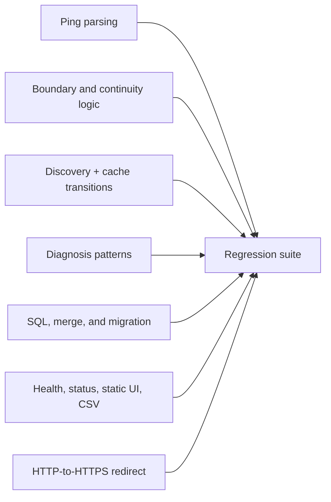
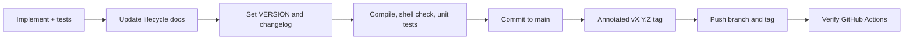

# 10 · Development and releases

Uplink Ledger keeps development close to production: the same Python files,
static assets, shell installer, and `systemd` unit in the repository are copied
to the host. There is no generated runtime bundle.

## Source map



## Runtime dependency rule

The supported service uses Python's standard library and operating-system
tools. Adding a Python package is an architectural change, not a casual import.
It must justify installation, offline upgrades, security maintenance, and
AlmaLinux lifecycle impact.

Development tooling may be added when it produces clear value without becoming
a production dependency.

## Local validation

Run from the repository root:

```sh
python3 -m py_compile isp_loss_monitor.py import_csv_to_postgres.py scripts/check_docs.py
python3 scripts/check_docs.py
sh -n install.sh
python3 -m unittest discover -s tests -v
```

The documentation check validates the ordered guide set, local Markdown links,
and balanced code fences. The test suite creates temporary CSV files and mocks
PostgreSQL subprocess calls. Two HTTP tests bind ephemeral localhost ports.

GitHub Actions runs the same checks on Python 3.11, 3.12, and 3.13. AlmaLinux
10 remains the supported installation target even though parser and unit tests
also exercise FreeBSD-style network output.

## Test coverage map



Add a focused test for every behavioral change. Tests should use documentation
address ranges (`192.0.2.0/24`, `198.51.100.0/24`, and `203.0.113.0/24`) rather
than real production addresses.

## Running a development server

PostgreSQL remains mandatory in development. With a peer-authenticated local
database available, plain HTTP may be explicitly enabled for loopback-only UI
work:

```sh
python3 isp_loss_monitor.py \
  --listen 127.0.0.1 \
  --port 8443 \
  --insecure-http \
  --postgres-url postgresql:///isp_loss_monitor \
  --csv /tmp/uplink-ledger-dev.csv \
  --discovery-cache /tmp/uplink-ledger-discovery.json \
  --terminal-mode dashboard
```

Open `http://127.0.0.1:8443/`. Never use `--insecure-http` for the installed
service or bind that development command to an untrusted interface.

The process performs real discovery and pings. Use an isolated development host
when real network measurements are undesirable.

## Dashboard development

The browser UI has no build step. Edit:

- `web/index.html` for semantic structure;
- `web/styles.css` for responsive presentation; and
- `web/app.js` for polling, tables, statistics, Canvas charts, hover, range,
  and pan behavior.

After a change:

1. reload without relying on stale assets;
2. inspect browser console errors;
3. test desktop and narrow widths;
4. verify both charts independently;
5. verify keyboard-accessible native controls;
6. check live, waiting, no-history, warning, and unavailable-hop states; and
7. redact addresses in screenshots attached to issues or pull requests.

## Behavioral contracts to preserve

- Complete intervals remain wall-clock aligned.
- Interrupted intervals are discarded.
- All available destinations in a burst run concurrently.
- PostgreSQL remains authoritative and mandatory.
- CSV writes remain compatible or receive an explicit schema migration.
- First-Hop cache survives transient public-IP and traceroute failures.
- Classification remains conservative about intermediate ICMP loss.
- Existing paths, role, database, and service names remain upgrade-compatible.
- TLS remains the installed default and port 80 remains redirect-only.
- Packet-loss and latency chart navigation remains independent.

## Documentation changes are product changes

Update the guide that owns the affected lifecycle stage:

| Change | Documentation |
| --- | --- |
| Interpretation or thresholds | `01-evidence-model.md`, `05-reading-results.md` |
| Packages or install paths | `02-installation.md` |
| Option or default | `03-configuration.md` |
| Startup, shutdown, backup, upgrade | `04-operations.md` |
| Component or dependency | `06-architecture.md` |
| Schema, API, CSV | `07-data-and-api.md` |
| Privilege, TLS, firewall | `08-security.md`, `SECURITY.md` |
| Diagnostic behavior | `09-troubleshooting.md` |
| Test or release process | `10-development.md`, `CONTRIBUTING.md` |

Diagrams use GitHub-native Mermaid so they remain text-reviewable and versioned
with the behavior they explain.

## Version and release flow



Before a release:

1. update `VERSION` in `isp_loss_monitor.py`;
2. move relevant changelog entries from Unreleased to a dated version;
3. run all validation commands;
4. verify a representative AlmaLinux installation or upgrade for material
   service changes;
5. inspect the staged diff for real addresses, credentials, certificates,
   exports, and generated files;
6. create an annotated semantic-version tag; and
7. verify the public CI run.

## Contribution and security process

Read [CONTRIBUTING.md](../CONTRIBUTING.md) before opening a pull request. Use
the issue templates for normal bugs and proposals. Report vulnerabilities
through the private process in [SECURITY.md](../SECURITY.md), never through a
public issue containing exploit details.

Return to the [documentation map](README.md) or [project README](../README.md).
