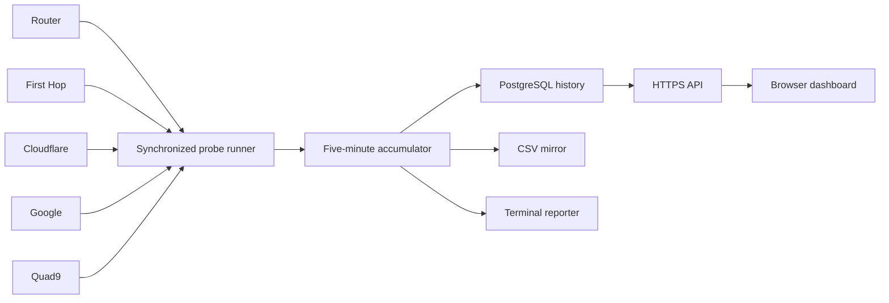

# Architecture

Uplink Ledger is a single Python process with standard-library HTTP/TLS,
sampling, discovery, terminal reporting, PostgreSQL persistence, and a static
browser dashboard.

## Process model

The main thread owns interval scheduling and persistence. Supporting daemon
threads handle:

- the HTTPS dashboard server;
- the optional HTTP-to-HTTPS redirect server; and
- periodic gateway, public-IP, and First-Hop rediscovery.

Each probe burst uses a bounded thread pool so all destinations are measured
over the same time window. Probe failures are converted into conservative
results without stopping measurements for the remaining destinations.

## Interval scheduling

The next interval always begins at the next exact multiple of the configured
interval length. With the default 300 seconds, intervals begin at `:00`,
`:05`, `:10`, and so on.

The service does not backfill missed probes or generate catch-up storms. If a
service stop or interruption prevents the complete window from being measured,
that interval is canceled and never written to PostgreSQL or CSV.

## Discovery

Discovery gathers three identifiers:

1. the Linux default gateway and interface;
2. the public IPv4 address returned by the configured HTTPS endpoint; and
3. the first responding traceroute hop after the router.

The discovery cache is keyed by gateway and public IPv4. If both remain
unchanged, the cached First Hop is reused. If either changes, traceroute runs
again. Failed public-IP checks and filtered retraces retain the last known hop
instead of deleting it.

## Measurement model

Each destination maintains a `StatsAccumulator` for the current interval. It
tracks sent and received packets plus individual RTT observations. Completed
metrics include:

- packet-loss percentage;
- minimum, average, and maximum RTT; and
- jitter as the mean absolute change between consecutive RTT samples.

The classifier compares Router, First Hop, and independent public destinations
and deliberately avoids declaring forwarding loss when only an intermediate
router's ICMP replies are missing.

## Persistence

PostgreSQL is the system of record:

- `isp_loss_intervals` contains one row per completed interval.
- `isp_loss_measurements` contains one row per destination and interval.

The interval start and destination key form stable identities. Upserts make
repeated writes and imports safe. The CSV mirror exists for export,
compatibility, and recovery from an interrupted database write.

At startup, recent CSV rows are synchronized into PostgreSQL. Dashboard
history and continuous-runtime boundaries are then reconstructed from the
database.

## Dashboard

The Python HTTP server provides static assets, JSON status, health, and CSV
export. The installed service requires TLS. A separate listener can issue `308
Permanent Redirect` responses from HTTP to the same hostname, path, and query
over HTTPS.

The browser initially loads up to 2016 intervals and then merges smaller live
updates every five seconds. Packet-loss and latency charts maintain independent
time ranges and pan positions.

## Privilege and filesystem model

The service runs as `ispmon`. `systemd` grants only `CAP_NET_RAW` for probes and
`CAP_NET_BIND_SERVICE` for ports 80 and 443. The unit enables additional
hardening and permits writes only beneath `/var/lib/isp-loss-monitor`.

Operational identifiers retain the historical `isp-loss-monitor` name so an
upgrade does not fork service state or strand an existing database.
