# Documentation map

This documentation follows the way Uplink Ledger is understood, deployed,
used, and maintained. Read it from top to bottom for a new installation, or
jump into the task-oriented path below.

```mermaid
flowchart LR
    E["1 · Evidence model"] --> I["2 · Installation"]
    I --> C["3 · Configuration"]
    C --> O["4 · Operations"]
    O --> R["5 · Read results"]
    R --> A["6 · Architecture"]
    A --> D["7 · Data and API"]
    D --> S["8 · Security"]
    S --> T["9 · Troubleshooting"]
    T --> V["10 · Development"]
```

## First deployment

1. [Evidence model](01-evidence-model.md)
2. [Installation](02-installation.md)
3. [Configuration](03-configuration.md)
4. [Operations](04-operations.md)
5. [Reading results](05-reading-results.md)

## Understand the implementation

6. [Architecture and technology choices](06-architecture.md)
7. [Data model, API, and exports](07-data-and-api.md)
8. [Deployment security](08-security.md)

## Maintain or change it

9. [Troubleshooting](09-troubleshooting.md)
10. [Development and releases](10-development.md)

## Find the answer by task

| I need to… | Go to… |
| --- | --- |
| Decide whether the evidence implicates the ISP | [Evidence model](01-evidence-model.md) and [Reading results](05-reading-results.md) |
| Install on a new AlmaLinux host | [Installation](02-installation.md) |
| Change ping frequency, gateway, ports, or history | [Configuration](03-configuration.md) |
| Restart, upgrade, back up, or restore the service | [Operations](04-operations.md) |
| Understand a card, chart, status, or threshold | [Reading results](05-reading-results.md) |
| Understand why the application uses this stack | [Architecture](06-architecture.md) |
| Query PostgreSQL or consume the API | [Data and API](07-data-and-api.md) |
| Harden access or renew a certificate | [Security](08-security.md) |
| Diagnose a startup, discovery, database, or UI problem | [Troubleshooting](09-troubleshooting.md) |
| Build, test, or release a change | [Development](10-development.md) |

Return to the [project README](../README.md) for the concise product overview.
