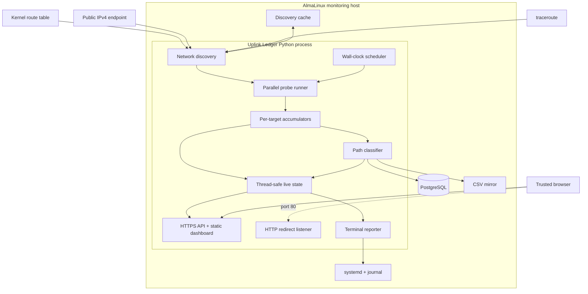
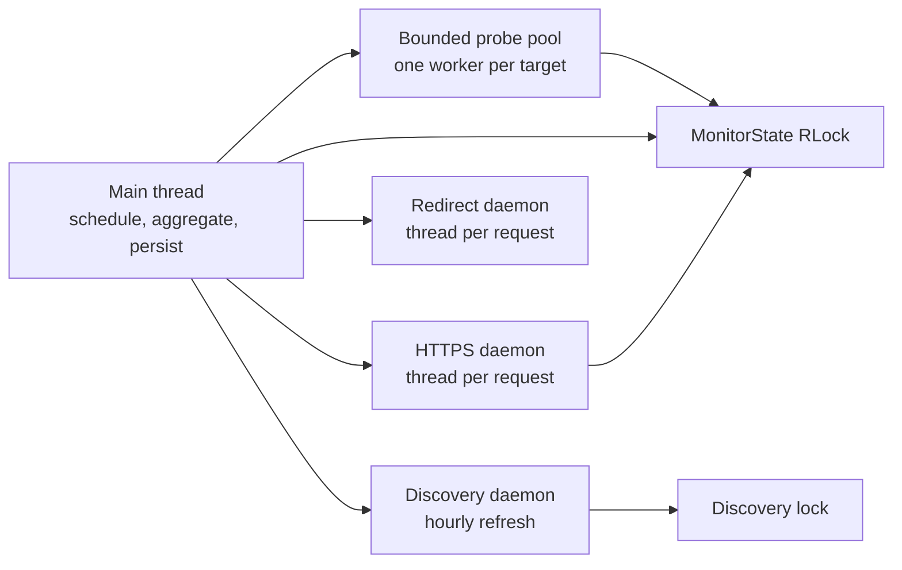
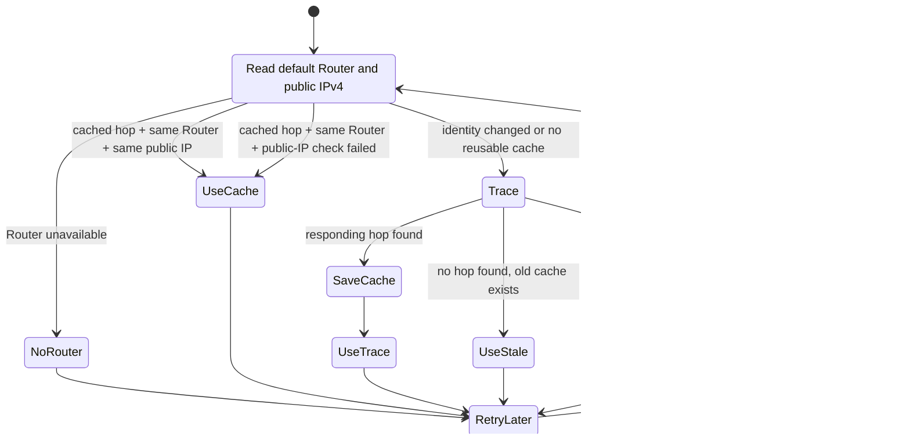
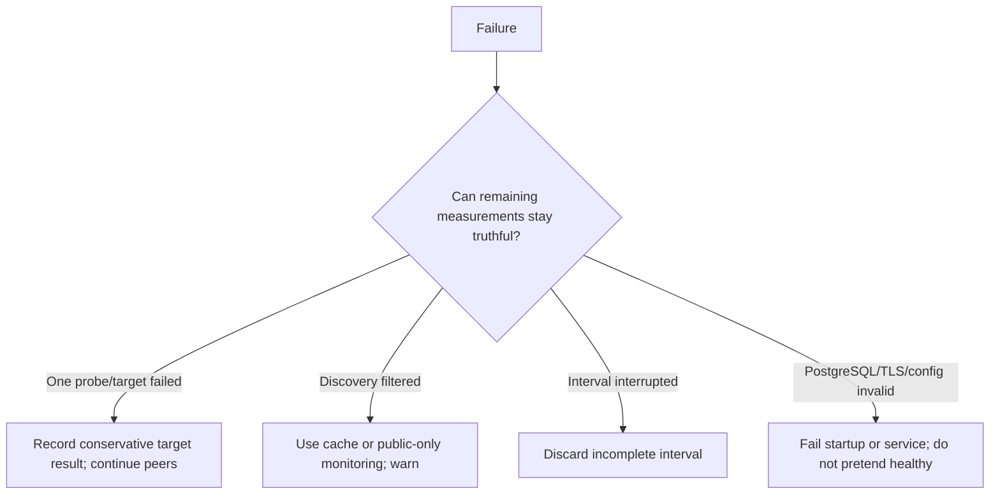

# Architecture

Uplink Ledger is one long-running Python process backed by local PostgreSQL.
It discovers the path, schedules synchronized probes, aggregates results,
persists completed intervals, serves a TLS dashboard, and reports to the
terminal.

The architecture is intentionally small enough for one operator to understand
from end to end.

## Design goals

1. Measure from the same side of the Router as real clients.
2. Compare several path points during the same time window.
3. Preserve complete, queryable history across process and host restarts.
4. Avoid silently recording incomplete intervals as normal data.
5. Run naturally on AlmaLinux with the fewest moving parts practical.
6. Make the service observable with ordinary operating-system tools.
7. Keep classification conservative and the raw measurements accessible.

Non-goals include high-frequency packet capture, distributed telemetry,
multi-tenant access control, synthetic browser tests, and bandwidth testing.

## Complete component view

## Process and thread model

The main thread owns interval boundaries and durable writes. The discovery
thread updates an immutable discovery snapshot under a lock. `MonitorState`
uses a re-entrant lock so browser requests can obtain consistent snapshots
while probe results update live data.

Probe exceptions are converted into conservative failed results for that
target. One destination cannot terminate the remaining target probes.

## Discovery state machine

The cache is written through a temporary file, flushed, synchronized, and
atomically replaced. Failed public-IP checks or traceroutes do not erase a
previously useful hop.

At startup, recent PostgreSQL/CSV history can seed a missing discovery cache,
which preserves First-Hop continuity across upgrades from older releases.

## Scheduling and concurrency

The next interval is always the next wall-clock multiple of the configured
duration. Inside the interval, monotonic time controls burst spacing so small
wall-clock adjustments do not distort waits.

Each burst submits every available target to a bounded thread pool. The main
thread waits for those results, updates accumulators, then advances to the next
slot. If processing runs late, the scheduler skips past missed slots rather
than compressing several bursts together.

## Persistence order

At interval completion the current implementation:

1. constructs one immutable record;
2. appends and `fsync`s the CSV row;
3. writes the interval and measurements in one PostgreSQL transaction;
4. publishes the completed record to in-memory history; and
5. reports completion to the terminal.

If PostgreSQL fails after the CSV append, service failure makes the problem
visible. At the next startup, recent CSV history is upserted into PostgreSQL,
repairing that narrow interruption window.

## Failure philosophy

The design favors visible gaps over fabricated completeness and visible
service failure over silent loss of authoritative data.
