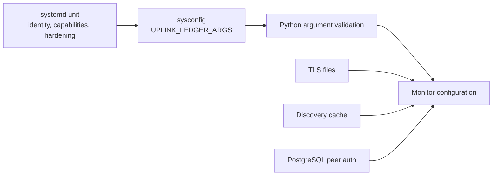
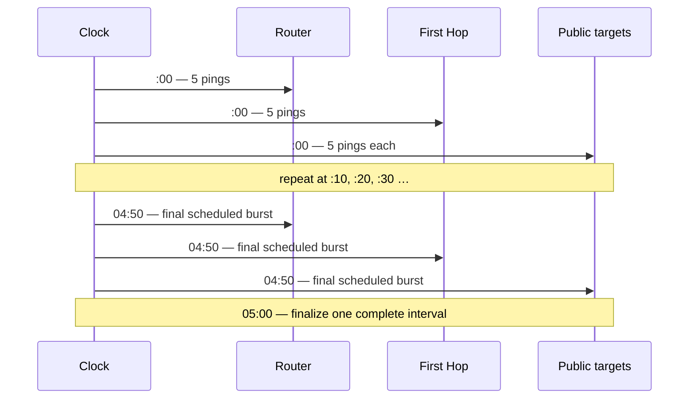

# Configuration

The installed service reads one shell-style environment value from
`/etc/sysconfig/uplink-ledger`:

```text
UPLINK_LEDGER_ARGS="--listen 0.0.0.0 --port 443 --http-redirect-port 80 --csv /var/lib/uplink-ledger/uplink-ledger.csv --discovery-cache /var/lib/uplink-ledger/discovery-cache.json --postgres-url postgresql:///uplink_ledger --tls-cert /etc/uplink-ledger/server.crt --tls-key /etc/uplink-ledger/server.key --terminal-mode lines"
```

Edit the value, then restart the service. There is no live configuration
reload.

```sh
sudo vi /etc/sysconfig/uplink-ledger
sudo systemctl restart uplink-ledger
sudo systemctl status uplink-ledger --no-pager -l
```

## Configuration layers



The `systemd` unit defines the service identity and security boundary. The
sysconfig file controls application behavior. PostgreSQL authentication and
certificate permissions are configured outside the application.

## Command-line reference

| Option | Default in program | Installed value / purpose |
| --- | --- | --- |
| `--listen ADDRESS` | `127.0.0.1` | Installed as `0.0.0.0` so trusted LAN clients can connect. |
| `--port PORT` | `443` | HTTPS dashboard port. |
| `--http-redirect-port PORT` | disabled | Installed as `80`; requires TLS and must differ from HTTPS port. |
| `--tls-cert PATH` | none | Required certificate/full-chain PEM for installed service. |
| `--tls-key PATH` | none | Required unencrypted private-key PEM for installed service. |
| `--insecure-http` | false | Testing only; explicitly permits serving without TLS. |
| `--postgres-url URI` | `postgresql:///uplink_ledger` | Local socket and peer auth; PostgreSQL is mandatory. |
| `--csv PATH` | `./uplink-ledger.csv` | Installed under `/var/lib/uplink-ledger`. |
| `--discovery-cache PATH` | `./discovery-cache.json` | Installed under `/var/lib/uplink-ledger`. |
| `--web-root PATH` | `web` beside program | Static dashboard asset directory. |
| `--gateway-address IPv4` | automatic | Overrides Router discovery when needed. |
| `--public-ip-url HTTPS_URL` | `https://ipv4.icanhazip.com/` | Returns one public IPv4 address. Must use HTTPS. |
| `--interval-seconds N` | `300` | Wall-clock aggregation window. Minimum 10. |
| `--burst-period N` | `10` | Seconds between synchronized bursts. Minimum 1 and no larger than interval. |
| `--ping-count N` | `5` | Pings per target per burst; 1–100. |
| `--ping-interval N` | `0.2` | Seconds between pings inside a burst; minimum 0.1. |
| `--reply-timeout N` | `1.5` | Per-reply wait used by `ping`; minimum 0.1. |
| `--discovery-period N` | `3600` | Seconds between rediscovery attempts; minimum 30. |
| `--history-limit N` | `2016` | Completed intervals held in service memory; minimum 1. |
| `--terminal-mode MODE` | `auto` | `auto`, `dashboard`, `lines`, or `quiet`. |

Run the installed program with `--help` to see the authoritative reference:

```sh
python3 /opt/uplink-ledger/uplink_ledger.py --help
```

## Sampling math

The default interval is:

```text
300 seconds ÷ 10 seconds per burst = 30 scheduled bursts
30 bursts × 5 pings = up to 150 pings per target per interval
5 available targets × 150 pings = up to 750 pings per interval
```

Targets run concurrently, not one after another.



Do not increase frequency simply to create a larger number. Defaults already
produce a useful sample while remaining negligible compared with ordinary LAN
traffic. More aggressive settings increase process creation, ICMP volume, and
the chance that endpoints rate-limit replies.

## Interval alignment

With `--interval-seconds 300`, boundaries are exact UTC epoch multiples, which
appear as `:00`, `:05`, `:10`, and so on in every time zone. Startup waits for
the next boundary. A late service does not backfill or fire catch-up bursts.

Changing the interval changes both alignment and the meaning of every record.
For evidence that must compare across days or hosts, keep the interval and
sampling settings consistent.

## Discovery configuration

Automatic discovery checks:

1. the host's IPv4 default route and interface;
2. the current public IPv4 through the configured HTTPS endpoint; and
3. traceroute toward `1.1.1.1` when the cached identity is not reusable.

Set `--gateway-address` when the default route is unusual or the host has
multiple routing domains. This changes the Router probe target but does not
force traffic through a different route.

The three public targets and traceroute destination are intentionally fixed in
the current release. Fixed independent addresses make results comparable over
time and avoid DNS failures contaminating measurements.

## PostgreSQL configuration

The installed URI:

```text
postgresql:///uplink_ledger
```

means “connect to the local PostgreSQL server over its Unix socket, use the
current OS username, and open database `uplink_ledger`.” The service runs as
`uplinkledger`, so peer authentication maps it to PostgreSQL role
`uplinkledger`.

PostgreSQL is not an optional sink. Startup fails if schema creation, history
loading, CSV synchronization, or the database connection fails. That behavior
prevents the service from appearing healthy while silently losing its
authoritative record.

## TLS and listeners

TLS is mandatory unless `--insecure-http` is explicitly present. Supplying
only a certificate or only a key is rejected. TLS uses Python's server context
with TLS 1.2 as the minimum protocol.

The port-80 listener only emits permanent `308` redirects. It does not serve
assets, API data, or CSV over plaintext.

Binding `0.0.0.0` is convenient but broad. Use the host firewall to define who
may connect, or bind a specific management address when the host has several
interfaces.

## Terminal modes

| Mode | Behavior |
| --- | --- |
| `auto` | Full-screen dashboard on an interactive terminal; completed lines when redirected or managed by `systemd`. |
| `dashboard` | Continuously redraws a terminal table for the live interval. |
| `lines` | Prints startup information and one compact line per completed interval; recommended for the journal. |
| `quiet` | Suppresses routine interval output. Fatal startup errors still reach stderr. |

## Memory history versus durable history

`--history-limit` controls only how many completed intervals the running
process keeps ready for the API and dashboard. The default `2016` equals seven
days at five-minute intervals.

It does **not** delete PostgreSQL or CSV history. PostgreSQL has no automatic
retention limit.

## Safe tuning checklist

Before changing sampling:

- preserve the same settings for the entire evidence period;
- ensure one burst can finish comfortably before the next begins;
- consider ICMP rate limits at all destinations;
- record the old and new values in an operational log;
- restart shortly before a boundary to minimize discarded time; and
- verify the first completed interval's sent count.
