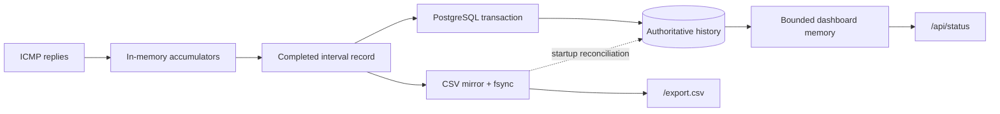
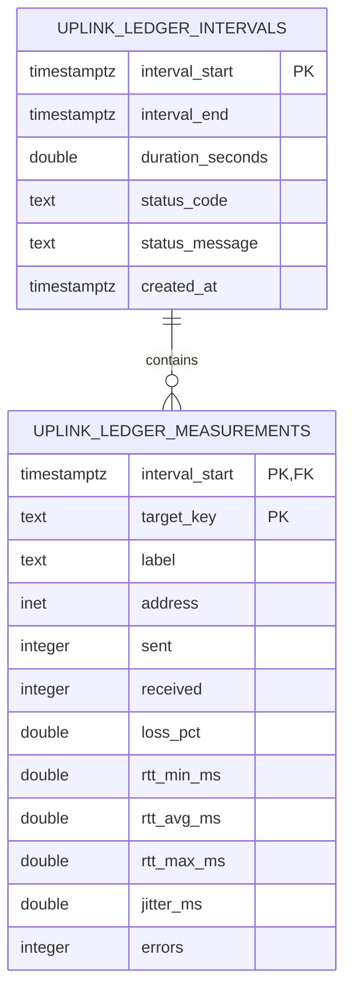

# Data model, API, and exports

PostgreSQL is the authoritative history store. The CSV file is an export and
recovery mirror. The browser API exposes bounded in-memory history plus live
state; it is not the long-term database interface.

## Data lifecycle



## Relational schema



One interval row contains the time window and diagnosis. Up to five child rows
contain target metrics. `(interval_start, target_key)` uniquely identifies a
measurement.

Indexes support recent-interval retrieval and per-target time series:

- `uplink_ledger_intervals(interval_end DESC)`
- `uplink_ledger_measurements(target_key, interval_start DESC)`

## Idempotency and recovery

Both tables use PostgreSQL upserts. Re-importing the same interval updates its
existing rows rather than creating duplicates.

```mermaid
sequenceDiagram
    participant CSV
    participant UL as Uplink Ledger startup
    participant PG as PostgreSQL

    UL->>CSV: Load recent compatible records
    UL->>PG: Ensure tables and indexes
    UL->>PG: Upsert recent CSV records
    UL->>PG: Calculate latest gap-free runtime group
    UL->>PG: Load bounded dashboard history
    UL->>UL: Merge by interval start; PostgreSQL wins conflicts
```

This reconciliation handles a stop between CSV append and database commit. It
also migrates recent history automatically when PostgreSQL is introduced to an
older CSV-based installation.

## API endpoints

| Endpoint | Response | Purpose |
| --- | --- | --- |
| `GET /api/health` | JSON | Minimal process/version health check. |
| `GET /api/status?limit=288` | JSON | Discovery, live interval, latest record, and bounded history. |
| `GET /export.csv` | CSV attachment | Download the on-disk mirror. |
| `GET /` | HTML | Dashboard entry point. |
| `GET /app.js` | JavaScript | Dashboard behavior. |
| `GET /styles.css` | CSS | Dashboard presentation. |

Unknown paths return `404`. Port 80 redirects all common HTTP methods to HTTPS
with `308 Permanent Redirect`; it does not provide the API.

The status `limit` is clamped to `1–2016`. Invalid values fall back to `288`
(24 hours at five-minute intervals).

## Status response shape

The response is compact JSON. This abbreviated example uses documentation-only
addresses:

```json
{
  "version": "1.3.0",
  "server_time": "2026-07-31T18:05:14Z",
  "started_at": "2026-07-31T12:00:02Z",
  "runtime_seconds": 21912,
  "continuous_started_at": "2026-07-30T08:00:00Z",
  "continuous_runtime_seconds": 122714,
  "discovery": {
    "gateway": "192.0.2.1",
    "interface": "enp1s0",
    "isp_hop": "198.51.100.9",
    "public_ip": "203.0.113.20",
    "isp_hop_source": "cache",
    "warning": null
  },
  "current": {
    "start": "2026-07-31T18:05:00Z",
    "deadline": "2026-07-31T18:10:00Z",
    "progress_pct": 4.7,
    "bursts_completed": 2,
    "targets": {}
  },
  "next_interval_start": null,
  "latest": {},
  "history": []
}
```

`current` is `null` while waiting for the next interval. `next_interval_start`
is then populated. `latest` is the most recent completed interval, and
`history` is ordered oldest to newest within the requested limit.

Each target object contains:

```json
{
  "label": "Cloudflare",
  "address": "1.1.1.1",
  "sent": 150,
  "received": 147,
  "loss_pct": 2.0,
  "rtt_min_ms": 17.1,
  "rtt_avg_ms": 22.8,
  "rtt_max_ms": 91.4,
  "jitter_ms": 4.2,
  "errors": 0
}
```

## CSV schema

Every CSV row represents one completed interval with schema version `1`.
Base columns are:

```text
schema_version
interval_start_utc
interval_end_utc
duration_seconds
status_code
status_message
```

Each target prefix—`gateway`, `isp_hop`, `cloudflare`, `google`, and `quad9`—
then includes:

```text
<target>_address
<target>_sent
<target>_received
<target>_loss_pct
<target>_rtt_min_ms
<target>_rtt_avg_ms
<target>_rtt_max_ms
<target>_jitter_ms
```

An incompatible existing header causes startup to fail with an explicit error
rather than appending a new schema to an old file.

## Historical CSV import

Stop an active writer before importing its file:

```sh
sudo systemctl stop uplink-ledger
sudo -u uplinkledger /usr/bin/python3 \
  /opt/uplink-ledger/import_csv_to_postgres.py \
  --csv /path/to/uplink-ledger.csv \
  --postgres-url postgresql:///uplink_ledger \
  --batch-size 200
sudo systemctl start uplink-ledger
```

Batch size may be `1–5000`. Import validates the CSV header, ensures the schema,
and upserts each interval in transactions.

## Useful SQL

### Coverage and row count

```sql
SELECT
    count(*) AS intervals,
    min(interval_start) AS first_interval,
    max(interval_end) AS last_interval
FROM uplink_ledger_intervals;
```

### Per-target loss summary

```sql
SELECT
    target_key,
    round(avg(loss_pct)::numeric, 2) AS average_loss_pct,
    round(max(loss_pct)::numeric, 2) AS worst_loss_pct,
    count(*) AS intervals
FROM uplink_ledger_measurements
WHERE interval_start >= now() - interval '24 hours'
GROUP BY target_key
ORDER BY target_key;
```

### Correlated public loss with a clean Router

```sql
SELECT
    m.interval_start,
    max(m.loss_pct) FILTER (WHERE m.target_key = 'gateway') AS router_loss,
    count(*) FILTER (
        WHERE m.target_key IN ('cloudflare', 'google', 'quad9')
          AND m.loss_pct >= 1.0
    ) AS affected_public_targets
FROM uplink_ledger_measurements AS m
GROUP BY m.interval_start
HAVING max(m.loss_pct) FILTER (WHERE m.target_key = 'gateway') < 1.0
   AND count(*) FILTER (
        WHERE m.target_key IN ('cloudflare', 'google', 'quad9')
          AND m.loss_pct >= 1.0
   ) >= 2
ORDER BY m.interval_start;
```

### Database size

```sql
SELECT pg_size_pretty(pg_database_size(current_database()));
```

Run examples through the peer-authenticated service identity:

```sh
sudo -u uplinkledger psql -d uplink_ledger
```

## Data ownership and privacy

The database and CSV can reveal private addresses, public addresses, outage
times, and usage patterns. Restrict filesystem and database access, redact
exports before sharing publicly, and treat backups as operationally sensitive.
