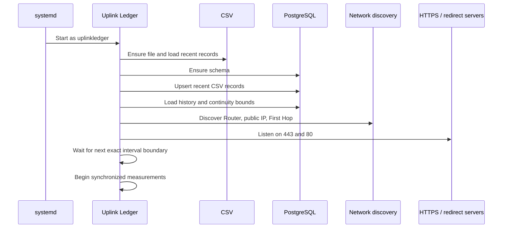
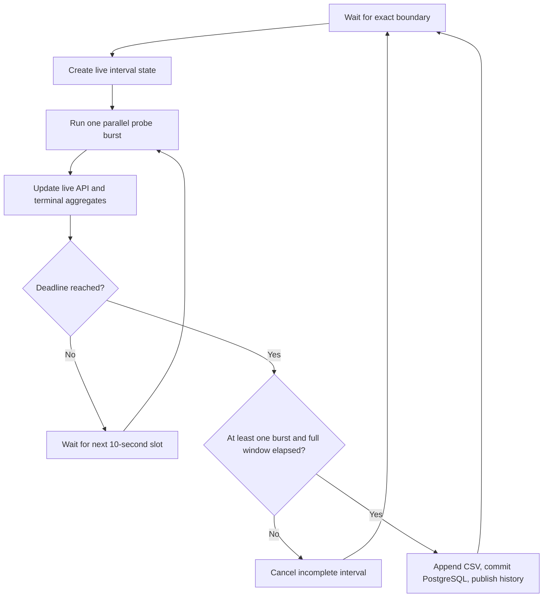
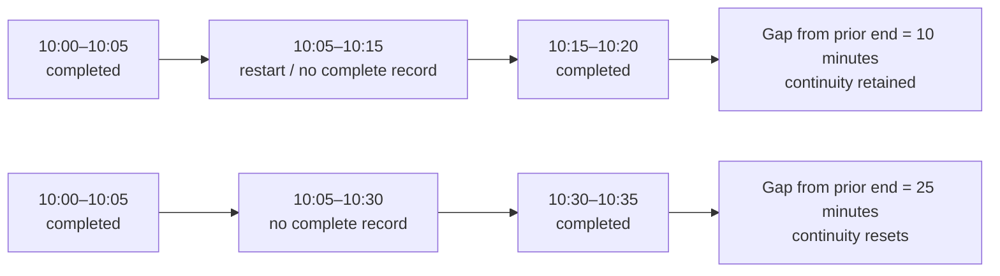

# Operations

Uplink Ledger is intended to run continuously under `systemd`. PostgreSQL
retains completed history, the CSV mirrors exports, and a short restart does
not necessarily reset the displayed continuous runtime.

## Startup lifecycle



Startup is deliberately fail-fast around PostgreSQL and TLS. A process that
cannot persist authoritative history or provide its configured secure listener
should not continue in a degraded, misleading state.

## Everyday service commands

```sh
sudo systemctl status uplink-ledger --no-pager -l
sudo journalctl -u uplink-ledger -f
sudo systemctl restart uplink-ledger
sudo systemctl stop uplink-ledger
sudo systemctl start uplink-ledger
```

Check the version:

```sh
python3 /opt/uplink-ledger/uplink_ledger.py --version
```

Check health without loading the dashboard:

```sh
curl --fail https://monitor.example.com/api/health
```

## What happens during an interval



Missed burst slots are skipped. They are never replayed in a catch-up storm.
If the service stops before the deadline, that partial interval is absent from
durable history.

## Continuous runtime across restarts

The runtime card reconstructs continuity from PostgreSQL, not merely the
current process start time.



The exact rule compares the next interval start with the previous completed
interval end:

- gap `≤ 600` seconds: keep the earlier continuous start;
- gap `> 600` seconds: begin a new continuous run.

Process uptime and continuous measurement runtime are separate API values.

## Time synchronization

Wall-clock alignment depends on a healthy system clock. Verify it periodically:

```sh
timedatectl status
```

The scheduler uses UTC-aware wall-clock boundaries and a monotonic timer inside
each interval. Avoid manually changing the clock during an evidence run.

## Upgrade procedure

The installer preserves sysconfig, TLS material, PostgreSQL data, the CSV
mirror, and the discovery cache.

```sh
cd uplink-ledger
git pull --ff-only

python3 -m unittest discover -s tests -v

sudo ./install.sh
sudo systemctl enable --now uplink-ledger
sudo systemctl status uplink-ledger --no-pager -l
```

Upgrade near a five-minute boundary when practical. Stopping during an interval
discards only that incomplete interval. Confirm the installed version and the
next completed database row afterward.

### Upgrading from the earlier operational name

Version 1.4 completes the product rename. When the installer finds the earlier
installation, it stops and disables its unit, then migrates:

- the operating-system and PostgreSQL role to `uplinkledger`;
- the PostgreSQL database to `uplink_ledger`;
- application, configuration, TLS, CSV, cache, and state paths;
- the sysconfig variable and arguments; and
- the PostgreSQL table and index names on the first new service start.

If `pg_hba.conf` contains a narrow rule for the previous database and role,
change that rule to the current values and reload PostgreSQL before starting
the new unit:

```text
local   uplink_ledger   uplinkledger   peer
```

```sh
sudo systemctl reload postgresql
sudo -u uplinkledger psql -d uplink_ledger -c 'SELECT current_user;'
sudo systemctl enable --now uplink-ledger
```

The installer stops rather than choosing when both the legacy and current OS
or PostgreSQL identities already exist. Resolve that ambiguity before retrying;
it will not merge two independent databases.

## Back up history

PostgreSQL is authoritative. Back it up with `pg_dump`:

```sh
sudo -u uplinkledger pg_dump \
  --format=custom \
  --file=/var/lib/uplink-ledger/uplink-ledger.backup \
  uplink_ledger
```

Copy the backup to storage outside the monitoring host. Also preserve these
small operational files when rebuilding the same installation:

```text
/etc/sysconfig/uplink-ledger
/etc/uplink-ledger/server.crt
/etc/uplink-ledger/server.key
/var/lib/uplink-ledger/discovery-cache.json
/var/lib/uplink-ledger/uplink-ledger.csv
```

Treat the private key as sensitive. A new host may use a newly issued
certificate rather than restoring the old key.

Test restores into a separate empty database before relying on a backup. See
[Data and API](data-and-api.md) for schema and CSV recovery behavior.

## CSV export and migration

Download the mirror from the dashboard or:

```sh
curl --fail --output uplink-ledger.csv \
  https://monitor.example.com/export.csv
```

To import a historical CSV archive, stop the writer and run the idempotent
importer:

```sh
sudo systemctl stop uplink-ledger
sudo -u uplinkledger /usr/bin/python3 \
  /opt/uplink-ledger/import_csv_to_postgres.py \
  --csv /var/lib/uplink-ledger/uplink-ledger.csv
sudo systemctl start uplink-ledger
```

Repeated imports are safe because interval and target keys are upserted.

## Capacity and retention

At five-minute intervals, one uninterrupted year produces approximately:

- `105,120` interval rows; and
- up to `525,600` measurement rows for five targets.

Actual database size depends on PostgreSQL version, indexes, address
availability, and maintenance. Monitor it instead of guessing:

```sh
sudo -u uplinkledger psql -d uplink_ledger -c \
  "SELECT pg_size_pretty(pg_database_size(current_database()));"
```

There is no automatic retention policy. Back up the database before deleting
history, and retain the time span required for seasonal or recurring ISP
analysis.

## Certificate renewal

Replace the certificate and key atomically or during a short service stop,
preserve `root:uplinkledger` ownership and `0640` modes, then restart:

```sh
sudo systemctl restart uplink-ledger
sudo journalctl -u uplink-ledger -n 30 --no-pager
```

The Python TLS context loads certificate material only at process startup.

## Graceful shutdown

`systemctl stop` and `Ctrl+C` set the same stop event. The service cancels an
incomplete interval, shuts down both web listeners, joins its helper threads,
and exits. `systemd` allows 15 seconds before escalating termination.
