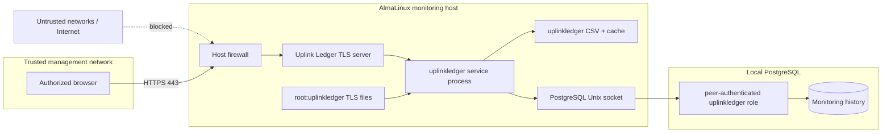

# Deployment security

Uplink Ledger is a trusted-network operational tool. It encrypts browser
traffic and runs with a constrained service identity, but it does not implement
user accounts, sessions, or application authorization.

The primary control is network placement: only trusted management clients
should reach TCP 80 and 443.

## Trust boundaries



## Information exposed by the dashboard

An authorized browser can retrieve:

- Router, First-Hop, public, and fixed endpoint addresses;
- current and historical packet-loss and RTT behavior;
- service and continuous runtime;
- discovery warnings and interface names;
- all history present in the CSV mirror; and
- application version.

That is operationally sensitive even when it contains no password. Do not
publish the dashboard or unredacted exports casually.

## Service identity and capabilities

The service runs as `uplinkledger`, not root. The unit grants only:

| Capability | Reason |
| --- | --- |
| `CAP_NET_RAW` | Permit ICMP-related network operation where the OS requires it. |
| `CAP_NET_BIND_SERVICE` | Bind conventional ports 80 and 443 without running as root. |

Both the ambient and bounding capability sets contain only those values.
`NoNewPrivileges=yes` prevents gaining additional privilege through executed
programs.

## `systemd` hardening

The installed unit enables:

- `ProtectSystem=strict`
- `ProtectHome=yes`
- `ProtectKernelTunables=yes`
- `ProtectKernelModules=yes`
- `ProtectControlGroups=yes`
- `PrivateTmp=yes`
- `LockPersonality=yes`
- `MemoryDenyWriteExecute=yes`
- `RestrictAddressFamilies=AF_INET AF_UNIX AF_NETLINK`
- `ReadWritePaths=/var/lib/uplink-ledger`
- `UMask=0027`

The process can read its installed program and configuration but can write only
its designated data directory under the unit's filesystem sandbox.

## TLS model

The installed service requires a certificate and private key. TLS 1.2 is the
minimum accepted protocol. HSTS is sent on TLS responses:

```text
Strict-Transport-Security: max-age=31536000; includeSubDomains
```

Important consequences:

- the certificate SAN must match the dashboard hostname;
- browsers must trust the issuing CA;
- the unencrypted private key must remain readable only by `root:uplinkledger`;
- certificate replacement requires a service restart; and
- HSTS with `includeSubDomains` should be appropriate for the chosen hostname's
  parent domain policy.

Recommended file state:

```sh
sudo chown root:uplinkledger \
  /etc/uplink-ledger/server.crt \
  /etc/uplink-ledger/server.key
sudo chmod 0640 \
  /etc/uplink-ledger/server.crt \
  /etc/uplink-ledger/server.key
```

## HTTP behavior and headers

Port 80 issues a `308 Permanent Redirect` to the configured HTTPS port while
preserving path and query. It does not return monitoring data.

TLS API and static responses include:

```text
X-Content-Type-Options: nosniff
X-Frame-Options: DENY
Referrer-Policy: no-referrer
Content-Security-Policy: default-src 'self'; script-src 'self'; style-src 'self'; img-src 'self' data:; connect-src 'self'; frame-ancestors 'none'
Cache-Control: no-store        # API and CSV
```

Static assets use `no-cache` so browsers can revalidate updated application
files.

## Network access control

Prefer one or more of:

1. bind only a management interface;
2. permit TCP 80/443 only from trusted subnets with `firewalld`;
3. require a VPN before the monitoring subnet is reachable; and
4. enforce equivalent restrictions on an upstream firewall.

Do not rely on an obscure port. Uplink Ledger uses 443 deliberately; security
comes from TLS and access control, not port secrecy.

Verify exposure from both an allowed client and an untrusted network. A local
success does not prove the firewall is appropriately scoped.

## PostgreSQL security

The default URI uses a local Unix socket. Peer authentication validates the
operating-system identity, so no database password is stored in sysconfig,
process arguments, or the repository.

The `uplinkledger` PostgreSQL role is created without superuser, role creation, or
database creation privileges and owns only its database. Keep the specific
peer rule before broader `pg_hba.conf` rules.

Avoid changing the URI to a TCP connection unless there is an operational need
and an explicit authentication/TLS design for that connection.

## External network dependencies

Uplink Ledger makes outbound requests to:

- the configured public IPv4 HTTPS endpoint;
- the Router and discovered First Hop via ICMP;
- Cloudflare, Google, and Quad9 via ICMP; and
- Cloudflare's address as the traceroute destination.

The public-IP request forces HTTPS through `curl --proto =https`, uses timeouts,
and validates that the response is a usable IPv4 address. Failure retains
usable cache state where possible.

## Threats intentionally not solved in the application

| Threat | Required deployment control |
| --- | --- |
| Unauthorized LAN user reads history | Firewall/VPN segmentation; the app has no login. |
| Compromised trusted browser exports data | Endpoint security and least-privilege network access. |
| Root compromise on monitoring host | Host hardening, patching, audit, and backup controls. |
| Malicious local PostgreSQL administrator | Database/host administrative controls. |
| ICMP spoofing or path manipulation | Treat results as operational evidence, not cryptographic attestation. |
| Public-IP endpoint compromise | Response validation limits format, but the endpoint can still influence rediscovery behavior. |
| Denial of service against the dashboard | Network restriction and host controls; no application rate limiter is included. |

## Certificate-renewal checklist

- [ ] New certificate SAN matches the production hostname.
- [ ] Issuer chain is complete.
- [ ] Private key is unencrypted.
- [ ] Files are `root:uplinkledger` and mode `0640`.
- [ ] Service restarts without TLS errors.
- [ ] `/api/health` validates from a trusted client.
- [ ] Port 80 still redirects to the correct HTTPS hostname.
- [ ] Old key material is removed according to local policy.

## Reporting vulnerabilities

Follow [SECURITY.md](../SECURITY.md). Use GitHub private vulnerability
reporting and never place credentials, certificates, private keys, addresses,
database dumps, or exploit details in a public issue.
