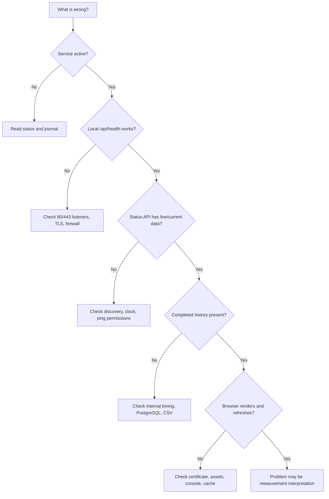

# Troubleshooting

Start with the symptom, then move inward from service state to dependencies,
listeners, discovery, measurements, persistence, and browser behavior.

## Diagnostic path



## Baseline commands

Collect these first:

```sh
sudo systemctl status uplink-ledger --no-pager -l
sudo journalctl -u uplink-ledger -n 100 --no-pager
sudo ss -ltnp '( sport = :80 or sport = :443 )'
sudo -u uplinkledger psql -d uplink_ledger -c 'SELECT 1;'
timedatectl status
```

The startup log reports version, dashboard URL, CSV path, PostgreSQL URI,
sampling plan, Router, public IP, First Hop, and discovery warning.

## Service fails immediately

Run the installed program's argument validation through its normal unit
configuration by reading the journal. Then verify required files and commands:

```sh
sudo cat /etc/sysconfig/uplink-ledger
command -v python3 ping traceroute ip curl psql
sudo -u uplinkledger test -r /etc/uplink-ledger/server.crt
sudo -u uplinkledger test -r /etc/uplink-ledger/server.key
```

Common startup-stopping failures are:

- missing or invalid TLS file;
- encrypted private key;
- PostgreSQL unavailable or peer authentication rejected;
- incompatible CSV header;
- another process already owns 80 or 443;
- invalid option value;
- missing dashboard asset; or
- missing required executable.

## PostgreSQL peer authentication fails

The operating-system and PostgreSQL identities must both be `uplinkledger`:

```sh
id uplinkledger
sudo -u postgres psql -Atc \
  "SELECT rolname FROM pg_roles WHERE rolname='uplinkledger';"
sudo -u uplinkledger psql -d uplink_ledger -c 'SELECT current_user;'
```

Confirm this rule occurs before broader local rules in
`/var/lib/pgsql/data/pg_hba.conf`:

```text
local   uplink_ledger   uplinkledger   peer
```

Then reload:

```sh
sudo systemctl reload postgresql
```

The unit explicitly requires `postgresql.service`, so also confirm that service
name is correct for the local installation.

## TLS certificate or key error

Check permissions and certificate metadata:

```sh
sudo ls -l \
  /etc/uplink-ledger/server.crt \
  /etc/uplink-ledger/server.key
sudo -u uplinkledger test -r /etc/uplink-ledger/server.key
openssl x509 \
  -in /etc/uplink-ledger/server.crt \
  -noout -subject -issuer -dates -ext subjectAltName
```

The key must be PEM encoded and unencrypted. Correct ownership is
`root:uplinkledger`; mode should be `0640`.

If the service starts but a browser warns, verify DNS, SAN, chain completeness,
client time, and client trust for the issuer.

## Dashboard is unreachable

Test on the host while preserving the production hostname for TLS validation:

```sh
curl --fail --resolve monitor.example.com:443:127.0.0.1 \
  https://monitor.example.com/api/health
```

If this succeeds, Uplink Ledger and TLS are working locally. Inspect:

- host `firewalld` rules and active zone;
- upstream firewall policy;
- DNS result from the client;
- routing between client and host; and
- whether the dashboard is bound to the intended address.

The installer never opens firewall ports automatically.

## HTTP does not redirect to HTTPS

```sh
curl --head http://monitor.example.com/history?limit=288
```

Expect status `308` and an HTTPS `Location` preserving path and query. Check
that `--http-redirect-port 80` remains in `UPLINK_LEDGER_ARGS`, TLS is
configured, and port 80 is not owned by another service.

## Router is unavailable or wrong

Inspect the host route:

```sh
ip -4 route show default
```

Multiple default routes, policy routing, a container namespace, or a VPN can
make automatic selection differ from the intended client path. Set
`--gateway-address` only after identifying the correct Router address.

An explicit probe address does not change the kernel's forwarding route.

## First Hop is unavailable

Many ISP routers filter or rate-limit traceroute responses:

```sh
traceroute -n -m 12 -q 1 -w 2 1.1.1.1
sudo -u uplinkledger cat /var/lib/uplink-ledger/discovery-cache.json
```

Behavior depends on prior state:

- usable cache + unchanged Router/public IP: reuse cache;
- public-IP check failure + usable same-Router cache: reuse cache with warning;
- changed identity + failed trace + old cache: use stale cache with warning;
- no cache + failed trace: continue with Router and public targets only.

The service retries discovery at the configured period.

## Public-IP check fails

```sh
sudo -u uplinkledger curl --fail --silent --show-error \
  --proto '=https' \
  https://ipv4.icanhazip.com/
```

Check DNS, CA trust, outbound HTTPS policy, proxy requirements, and endpoint
availability. A failure does not erase a usable First-Hop cache.

## Ping permission or all-target failures

Confirm normal and service-user behavior:

```sh
ping -n -c 5 -i 0.2 -W 2 1.1.1.1
sudo -u uplinkledger ping -n -c 5 -i 0.2 -W 2 1.1.1.1
sudo systemctl show uplink-ledger \
  -p AmbientCapabilities -p CapabilityBoundingSet -p NoNewPrivileges
```

Inspect host ICMP policy, security tooling, and the installed unit if manual
root pings work but the service does not.

## No completed history appears

The service waits for the next exact boundary and records only complete
intervals. Check current state:

```sh
curl --fail 'https://monitor.example.com/api/status?limit=1'
```

Look for either `current` or `next_interval_start`. Then query PostgreSQL:

```sh
sudo -u uplinkledger psql -d uplink_ledger -c \
  'SELECT count(*), max(interval_end) FROM uplink_ledger_intervals;'
```

Frequent restarts, clock changes, or stops before interval deadlines can leave
intentional gaps.

## Continuous runtime reset unexpectedly

Inspect gaps between completed records:

```sh
sudo -u uplinkledger psql -d uplink_ledger -c \
  "SELECT interval_start, interval_end, interval_start - lag(interval_end) OVER (ORDER BY interval_start) AS gap FROM uplink_ledger_intervals ORDER BY interval_start DESC LIMIT 20;"
```

A gap greater than ten minutes begins a new continuous group. The runtime card
uses the most recent group from PostgreSQL.

## CSV header is incompatible

The service refuses to mix different schemas in one file. Preserve the old
file, move it outside the active path, and allow Uplink Ledger to create a
fresh header. Do not delete history until it is backed up or imported.

Use the standalone importer only with a schema-version-1 file whose header
matches this release. See [Data and API](data-and-api.md).

## API works but charts are empty or stale

1. Confirm `/api/status?limit=12` contains completed `history`.
2. Reload the page after an upgrade so static assets revalidate.
3. Verify `/app.js` and `/styles.css` return `200`.
4. Inspect the browser console for JavaScript errors.
5. Confirm the certificate is accepted; failed API polling may appear as a
   stale UI.

The browser loads up to seven days initially, then merges smaller five-second
refreshes. Each chart's range and pan state is independent.

## Results look contradictory

Use the forwarding path as the stronger signal:

- First-Hop loss with clean public targets usually means ICMP limiting.
- Router loss with clean public targets can also mean Router ICMP limiting.
- One public endpoint alone is route-specific evidence.
- A clean Router and correlated loss across several downstream targets is the
  strongest downstream pattern.

Review [Evidence model](evidence-model.md) before treating an intermediate
hop as proof of forwarding loss.

## Collect a redacted diagnostic bundle

```sh
sudo systemctl status uplink-ledger --no-pager -l
sudo journalctl -u uplink-ledger -n 200 --no-pager
sudo -u uplinkledger psql -d uplink_ledger -c \
  'SELECT count(*), min(interval_start), max(interval_end) FROM uplink_ledger_intervals;'
python3 /opt/uplink-ledger/uplink_ledger.py --version
```

Before sharing, remove public/private addresses, hostnames, certificate details,
database contents, and other topology information not required to reproduce
the issue.
